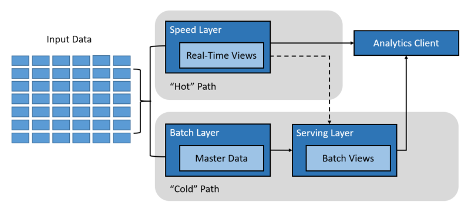
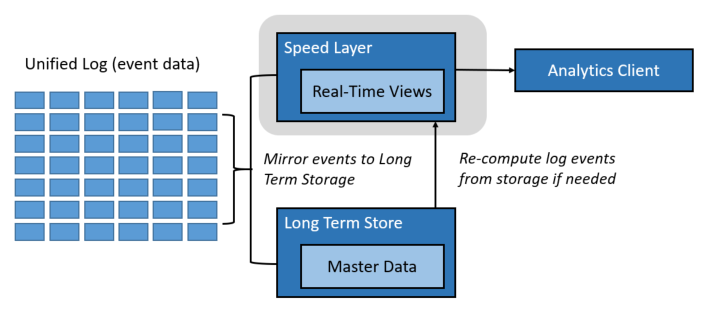
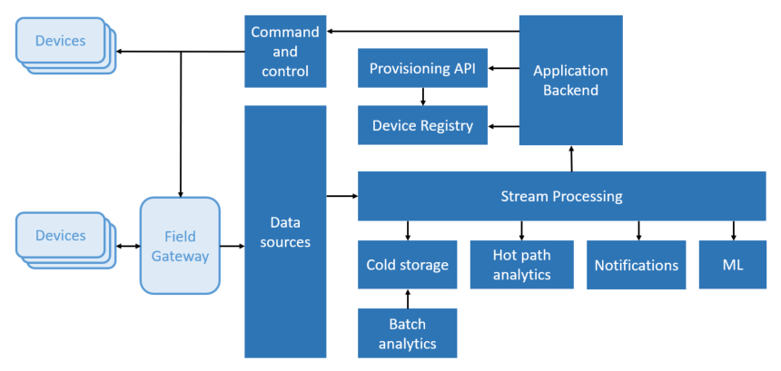

# Big Data

**In this article**

[About]()  
[Data lake](#datalake)  
[Lambda architecture](#lambdaarchitecture)  
[Kappa architecture](#kappaarchitecture)  
[Internet of Things](#internetofthings)  <!--leaving caps per the style guide.-->
[Where to go from here](#wheretogo)  

A big data architecture is designed to handle the ingestion, processing, and analysis of data that is too large or complex for traditional database systems. The threshold at which organizations enter into the big data realm differs, depending on the capabilities of the users and their tools. For some, it can mean hundreds of gigabytes of data, while for others it means hundreds of terabytes. As tools to help you work with big data sets advance, so does the meaning of big data. More and more, this term relates to the value you can extract from your data sets through advanced analytics, like predictive or user behavior analytics, than strictly the size of your data set, though in these cases they tend to be quite large.

Over the years, the data landscape has changed. What you can do, or are expected to do, with that data has changed. The cost of storage keeps plummeting, while the means by which data is collected keeps growing. The old data doesn't just go away, in many respects.<!--It feels like there should be somethng that follows "respects" here. Otherwise this sentence feels like a throw away.--> Some data arrives at a rapid pace, constantly demanding to be collected and observed. Other data comes in slow, but in very large chunks, oftentimes in the form of decades of historical data. You might be facing an advanced analytics problem, or one that requires machine learning. These are all examples of challenges that big data architectures seek to solve.

Big data solutions typically involve one or more of the following types of workload:

* Batch processing of big data sources at rest.
* Real-time processing of big data in motion.
* Interactive exploration of big data.
* Predictive analytics and machine learning.

Consider big data architectures when you need to:

* Store and process data in volumes too large for a traditional database.
* Transform unstructured data for analysis and reporting.
* Capture, process, and analyze unbounded streams of data in real time, or with low latency.

 <!--Technically there should be a comma after Analytics in the right column, but it's not vital.-->

Most big data architectures include some or all of the following components:

* **Data sources**: All big data solutions start with one or more data sources. Examples include:

    * Application data stores, such as relational databases.
    * Static files produced by applications, such as web server log files.
    * Real-time data sources, such as IoT devices.

* **Data storage**: Data for batch processing operations is typically stored in a distributed file store that can hold high volumes of large files in various formats. This kind of store is often called a [*data lake*](#datalake). Options for implementing this storage include Azure Data Lake Store or blob containers in Azure Storage.

* **Batch processing**: Because the data sets are so large, often a big data solution must process data files using long-running batch jobs to filter, aggregate, and otherwise prepare the data for analysis. Usually these jobs involve reading source files, processing them, and writing the output to new files. Options include running U-SQL jobs in Azure Data Lake Analytics, using Hive, Pig, or custom Map/Reduce jobs in an HDInsight Hadoop cluster, or using Java, Scala, or Python programs in an HDInsight Spark cluster.

* **Real-time message ingestion**: If the solution includes real-time sources, the architecture must include a way to capture and store real-time messages for stream processing. This might be a simple data store, where incoming messages are dropped into a folder for processing. However, many solutions need a message ingestion store to act as a buffer for messages, and to support scale-out processing, reliable delivery, and other message queuing semantics. This portion of a streaming architecture is often referred to as stream buffering. Options include Azure Event Hubs, Azure IoT Hubs, and Kafka.

* **Stream processing**: After capturing real-time messages, the solution must process them by filtering, aggregating, and otherwise preparing the data for analysis. The processed stream data is then written to an output sink. Azure Stream Analytics provides a managed stream processing service based on perpetually running SQL queries that operate on unbounded streams. You can also use open source Apache streaming technologies like Storm and Spark Streaming in an HDInsight cluster.

* **Analytical data store**: Many big data solutions prepare data for analysis and then serve the processed data in a structured format that can be queried using analytical tools. The analytical data store used to serve these queries can be a Kimball-style relational data warehouse, as seen in most traditional business intelligence (BI) solutions. Alternatively, the data could be presented through a low-latency NoSQL technology such as HBase, or an interactive Hive database that provides a metadata abstraction over data files in the distributed data store. Azure SQL Data Warehouse provides a managed service for large-scale, cloud-based data warehousing. HDInsight supports Interactive Hive, HBase, and Spark SQL, which can also be used to serve data for analysis.

* **Analysis and reporting**: The goal of most big data solutions is to provide insights into the data through analysis and reporting. To empower users to analyze the data, the architecture may include a data modeling layer, such as a multidimensional OLAP cube or tabular data model in Azure Analysis Services. It might also support self-service BI, using the modeling and visualization technologies in Microsoft Power BI or Microsoft Excel. Analysis and reporting can also take the form of interactive data exploration by data scientists or data analysts. For these scenarios, many Azure services support analytical notebooks, such as Jupyter, enabling these users to leverage their existing skills with Python or R. For large-scale data exploration, you can use Microsoft R Server, either standalone or with Spark.

* **Orchestration**: Most big data solutions consist of repeated data processing operations, encapsulated in workflows, that transform source data, move data between multiple sources and sinks, load the processed data into an analytical data store, or push the results straight to a report or dashboard. To automate these workflows, you can use an orchestration technology such Azure Data Factory or Apache Oozie and Sqoop.

##  Data lake
If you have read anything about big data before now, it is very likely you've seen or heard the term _data lake_. You may have seen the word used for the name of a product, or perhaps a concept about storing large quantities of data. Before we start talking about data lake technologies, let us first define the concept of a data lake.

A data lake consists of both storage and processing. Data lake storage is built with several goals in mind: fault-tolerance, infinite scalability, optimized for both real-time and long-term storage ingestion velocities of data with varying shapes and sizes. Data lake processing involves one or more processing engines built with these goals in mind, and can operate on data stored in a data lake at scale.

Data lake stores are often used in event streaming or IoT scenarios, given their ability to persist vast amounts of relational and nonrelational data without transformation or schema definition. They are built to handle high volumes of small writes at low latency, and are optimized for massive throughput.

Another term commonly used in data scenarios, is _datamart_. Typically, a datamart is a store of data that is cleansed, packaged, and structured for easy consumption. Where a data lake store differs is in its handling, or nonhandling, of data. It is built for ingesting raw data, leaving it in its original or least-processed form to allow questions to be asked of it in various ways, and at various times. If this data is cleansed and structured in a specific way, like in a datamart, then it is difficult to adapt how the data is processed and analyzed when new questions or tools come about in the future. This is why a data lake is composed of both storage and processing as separate entities.

Relevant Azure service:
- [Azure Data Lake](https://azure.microsoft.com/solutions/data-lake/)

###  Lambda architecture

The lambda architecture is a pipeline architecture originally devised with the goal to reduce complexity of a real-time analytics pipeline by constraining incremental computation activities to only a small portion of this architecture. This is accomplished by creating two paths for data flow into the pipeline:

* A hot path, or speed layer, used for rapid ingestion of latency-sensitive (or real-time) data, meant for rapid consumption by analytics clients.

* A cold path, or batch layer, that stores all of the incoming data for batch processing, where data processing can take anywhere from minutes to hours.

Data that flows into the hot path is constrained by latency requirements imposed by the speed layer so that it can be processed as quickly as possible, as data in this layer is typically desired in real time. Often, this requires a tradeoff of some level of accuracy in favor of data that is ready as quickly as possible. An example of this is incoming temperatures from a large swath of IoT devices. In this scenario, the speed layer may be used to process a subset of this incoming data in order to provide a live dashboard of temperature readings for several locations. The data in this case may be reduced by processing sliding windows of several seconds apiece, allowing the processing layer to perform calculations in a timely manner.

Data flowing into the cold path, on the other hand, is not subject to the same low latency requirements. This allows for high accuracy computation across large data sets, which can be very time intensive. In addition, data in this path is immutable, meaning any changes to the value of a particular datum are stored alongside existing values in the form of new, timestamped datum. This allows for recomputation of a particular datum at any point in time across the history of the data collected. The hot path is enabled by today's ability to capture and store all raw, immutable data, allowing us to recompute this data through batch computation at any time.

Eventually, the hot and cold paths converge at the analytics client application. If the client needs to display timely, yet potentially less accurate data in real time, it will acquire its result from the hot path. Otherwise, it will select results from the cold path to display less timely but more accurate data. In other words, the hot path has data for a relatively small window of time, after which the results can be updated with more accurate data from the cold path.

###  Kappa architecture

The kappa architecture is another type of pipeline with the same basic goals as the lambda architecture, but with one important distinction: all data (called events in this architecture) flows through a single hot path, where all processing occurs in a near-real-time streaming mode. It was created due to the nature of lambda architectures containing two paths, leading to potentially duplicate computation logic and the complexity of managing the architecture for both paths. Because there is no cold path in this architecture, any recomputation of data is performed by streaming through the kappa pipeline once again.

There are some similarities to the lambda architecture's cold path, in that the event data is immutable and all of it is collected, instead of a subset. The data, or events, are ingested into a distributed and fault tolerant unified log, of which there is a single deployment. These events are ordered, and the current state of an event is changed only by a new event being appended. Similar to a lambda architecture's hot path, all processing of events is performed on the input streams and persisted as a real-time view. This data can be recomputed at any point, as it is persisted to scalable, fault-tolerant storage.

###  Internet of Things (IoT)

From a practical viewpoint, Internet of Things (IoT) represents any device that is connected to the Internet. This includes your PC, mobile phone, smart watch, smart thermostat, smart refrigerator, connected automobile, heart monitoring implants, and anything else that connects to the Internet and sends or receives data. The number of connected devices grows every day, as does the amount of data collected from them. Oftentimes this data is being collected on the edge, in highly constrained, sometimes high latency environments. In other cases, data is sent from low latency environments by thousands or millions of devices, requiring the ability to rapidly ingest the barrage of data and process accordingly. Therefore, proper planning is required to handle these constraints and unique requirements.

Event-driven architectures are central to IoT solutions. The following diagram shows a possible logical architecture for IoT. The diagram emphasizes the event-streaming components of the architecture.

 <!--You might consider spelling out machine learning.-->

The **cloud gateway** ingests device events at the cloud boundary, using a reliable, low latency messaging system.

Devices might send events directly to the cloud gateway, or through a **field gateway**. A field gateway is a specialized device or software, usually collocated with the devices, that receives events and forwards them to the cloud gateway. The field gateway might also preprocess the raw device events, performing functions such as filtering, aggregation, or protocol transformation.

After ingestion, events go through one or more **stream processors** that can route the data (for example, to storage) or perform analytics and other processing.

The following are some common types of processing. (This list is certainly not exhaustive.)

- Writing event data to cold storage, for archiving or batch analytics.

- Hot path analytics, analyzing the event stream in (near) real time, to detect anomalies, recognize patterns over rolling time windows, or trigger alerts when a specific condition occurs in the stream. 

- Handling special types of nontelemetry messages from devices, such as notifications and alarms. 

- Machine learning.

The boxes that are shaded gray show components of an IoT system that are not directly related to event streaming, but are included here for completeness.

- The **device registry** is a database of the provisioned devices, including the device IDs and usually device metadata, such as location.

- The **provisioning API** is a common external interface for provisioning and registering new devices.

- Some IoT solutions allow **command and control messages** to be sent to devices.

Relevant Azure service:  
- [Azure IoT Hub](https://azure.microsoft.com/services/iot-hub/)  
- [Azure Event Hubs](https://azure.microsoft.com/services/event-hubs/)  
- [Azure Stream Analytics](https://azure.microsoft.com/services/stream-analytics/)  

Learn more about IoT on Azure by reading the [Azure IoT reference architecture](https://azure.microsoft.com/updates/microsoft-azure-iot-reference-architecture-available/).

## Where to go from here

Read next: [Processing CSV and JSON Files pipeline pattern](../pipeline-patterns/processing-csv-and-json-files.md)

See also:

Related pipeline patterns
- Handling unstructured data
    - [Processing free-form text files](../pipeline-patterns/processing-free-form-text.md)
- [Time-series solutions](../pipeline-patterns/time-series.md)

Related technology choices
- [Data serving storage](../technology-choices/data-serving-storage.md)
- Handling unstructured data
    - [Options for processing CSV and JSON files](../technology-choices/csv-json-options.md)
    - [Enabling full text search on free-form text files](../technology-choices/search-options.md)
    - [Processing free-form text files with natural language processing](../technology-choices/natural-language-processing.md)
