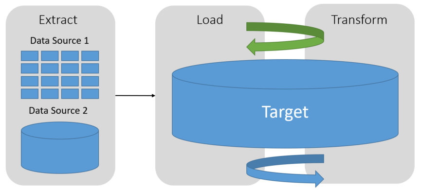
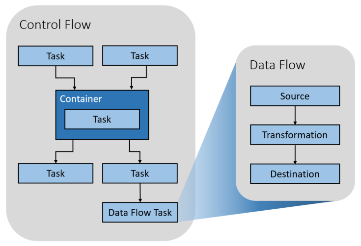

# Data Pipeline

**In this article**

[About]()  
[Extract, Transform, and Load](#etl)  
[Extract, Load, and Transform](#elt)  
[Data Flow & Control Flow](#dataflowcontrolflow)  
[Where to go from here](#wheretogo)  

Gathering data from multiple sources, in multiple formats, and moving it to one or more data stores is a common problem organizations face on a daily basis. The destination may or may not be the same type of data store as the source, and oftentimes the format is different, or the data needs to be shaped or cleaned in some fashion prior to loading it into its final destination.

Various tools, services, and processes have been developed over the years to help address these challenges. No matter the process used, there is a common need to coordinate the work and apply some level of data transformation within the data pipeline. The following highlight the common methods used to perform these tasks.

##  Extract, Transform, and Load

As the name implies, Extract, Transform, and Load (ETL) is a data pipeline process used to collect data from various sources, transform the data according to business rules, and load it into a destination data store. The transformation work in ETL takes place in a specialized engine, and oftentimes involves using staging tables to temporarily hold data as it is being transformed and ultimately loaded to its destination.

The data transformation that takes place usually involves various operations, such as filtering, sorting, aggregating, joining data, cleaning data, validating data, etc.

Oftentimes, the three ETL phases are run in parallel to save time. For example, while data is being extracted, a transformation process could be working on data that has already been received and prepare it for loading, and a loading process can begin working on prepared data, rather than waiting for the entire extraction process to complete.

Relevant Azure service:
[Azure Data Factory V2](https://azure.microsoft.com/services/data-factory/)

Other tools:
[SQL Server Integration Services (SSIS)](https://docs.microsoft.com/sql/integration-services/sql-server-integration-services)

##  Extract, Load, and Transform

Extract, Load, and Transform (ELT) differs from ETL in where the transformation takes place. In this case, the target does the transformation. This simplifies the data pipeline somewhat, by removing the transformation engine from ELT, but only works well when the target system is powerful enough to efficiently transform the data. The side benefit to this approach is that scaling the target data store also scales the ELT process performance.

Use cases for ELT typically fall within the big data realm. As an example, you might start by loading data from various sources so it can be queried with Hive or PolyBase. This data would be processed using a Hadoop cluster or a data warehouse capable of massively parallel processing, breaking the problem down into smaller chunks and processing across multiple machines in parallel to solve it faster. The data is transformed into a more performant final format, perhaps using partitioning and optimized storage like columnar Parquet with indexing. These last few steps would not be possible from a traditional ETL pipeline.

Relevant Azure service:
[Azure Data Factory V2](https://azure.microsoft.com/services/data-factory/)
[Oozie on HDInsight](https://docs.microsoft.com/azure/hdinsight/hdinsight-use-oozie-linux-mac)

Other tools:
[SQL Server Integration Services (SSIS)](https://docs.microsoft.com/sql/integration-services/sql-server-integration-services)

###  Data Flow & Control Flow

In the context of data pipelines, the control flow ensures orderly processing of a set of tasks. To enforce the correct processing order of these tasks, precedence constraints are oftentimes used. You can think of these constraints as connectors in a workflow diagram, as shown in the image below. Each task has an outcome, such as success, failure, or completion. Thanks in part to the precedence constraints, any subsequent task does not initiate processing until its predecessor has completed with one of these outcomes.

Data flows differ from control flows, in that tasks, or components within a data flow can run in parallel with one another. These are typically source, transformation, and destination task items. Data flows are executed by control flows as a task. They are responsible for transforming data, and the data is transferred from one data flow task to another. Unlike control flows, you cannot add constraints between tasks in a data flow. You can, however, add a data viewer to observe the data as it is processed by each task.

In the diagram above, there are several tasks within the control flow, one of which is a data flow task. One of the tasks is nested within a container. Containers can be used to provide structure to tasks, providing a unit of work. One such example is for repeating elements within a collection, such as files in a folder or database statements.

Relevant Azure service:
[Azure Data Factory V2](https://azure.microsoft.com/services/data-factory/)

Other tools:
[SQL Server Integration Services (SSIS)](https://docs.microsoft.com/sql/integration-services/sql-server-integration-services)

## Where to go from here

Read Next: [Data Warehousing Solution Pattern](../solution-patterns/data-warehousing.md)

See Also:

Related Solution Patterns
- Working with transactional data
    - [Online Transaction Processing (OLTP)](../solution-patterns/online-transaction-processing.md)
    - [Online Analytical Processing (OLAP)](../solution-patterns/online-analytical-processing.md)
    - [Data Warehousing](../solution-patterns/data-warehousing.md)

Related Technology Choices
- Transactional Data Stores
    - Online Transaction Processing (OLTP) data stores
    - Online Analytical Processing (OLAP) data stores
    - Data Warehouses
- Pipeline Orchestration, Control Flow and Data Movement
    - Azure Data Factory
    - Oozie on HDInsight
    - SQL Server Integration Services
