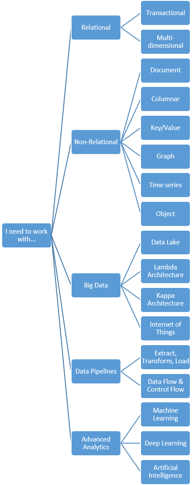

# Common Data Architectures

[What do we mean by common data architectures?](#meaning)   
[How do you approach using them?](#use)  
[Where to go from here](#wheretogo)  

##  What do we mean by common data architectures?
We provide common data architectures to represent the "big concepts" that deal with data that you need to know, and that by knowing them you are empowered to make the right architectural selections for your scenario and by extensions the right technology choices.  

##  How do you approach using them?
To understand how to apply a common data architecture to your scenario, start with the phrase "I need to work with..." and then complete the phrase with one of the following:
- [Relational data](./relational-data.md)
- Non-relational data
- Big data
- Data pipelines
- Advanced analytics

The common data architectures will guide you down a path of concepts that get more granular from the concept down to the generic form of technologies used in the architecture, and ultimately to help you make a choice amongst the various Azure options that exist. 

Use the following flow chart to begin your exploration:

 

If you are curious about a specify topic, you can also navigate this flowchart from right to left, starting with a topic you are familiar with to learn the related topics and how we group them into common architectures in this guide.

## Where to go from here

Read Next: [Relational Data Common Architecture](./relational-data.md)

See Also:

Related Common Architectures
- [Transactional Data](./transactional-data.md)
- [Semantic Modeling](./semantic-modeling.md)