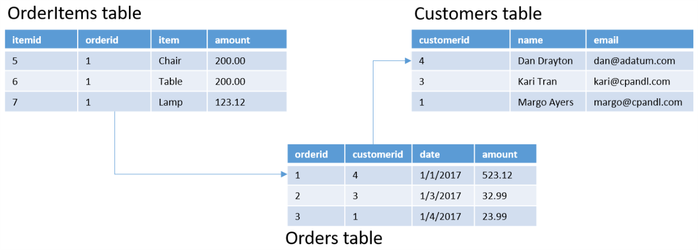

# Relational data 

**In this article**

[About]()  
[Common Architectures](#common)   
[Where to go from here](#wheretogo)  

Relational data is data whose model is based upon the relational model of data whereby all data is expressed as tuples, and the tuples are grouped into relations. A data store that organizes data in terms of the relational model is referred to as a relational database. Relational databases use a tabular structure to materialize the relational model- that is they expose all the data as rows in a table with a defined schema consisting of columns. Each column defines a name an a data type for all values stored in that column across all rows in the table. 

Most relational databases use the Structured Query Language (SQL) language that enables a  declarative approach to querying. The query author focuses solely on authoring a query that shapes the desired result, allowing the relational database engine to decide how to actually execute the query. This is as opposed to using a procedural approach used by other data stores, whereby the query program specifies the processing steps explicitly.  

Relational databases support varying forms of constraints, including:
- Primary key fields that are used to uniquely identify rows within a table.
- Foreign key fields that are used in one table to refer to a row in another table by referencing the primary key of other table. Foreign keys are used in maintaining referential integrity, ensuring that the referenced rows are not altered or deleted while the referencing row depends on them.
- Primary and secondary indexes. Primary indexes, which are used by the primary key, define the order of the data as it sits on disk. Secondary indexes provide an alternative combination of fields by which to quickly locate the desired rows, without having to re-sort the entire data on disk. The index structure used by relational databases typically includes B+ trees, R-trees and bitmaps. 
- Entity integrity contraints that use expressions to define constraints that limit the values that can be stored within a single column, or in relationship to values in other columns of the same row.

Additionally, relational databases allow for the storage of executable code routines in the form of stored procedures and functions, which enable a mixture of declarative and procedural approaches. 

The design of a relational database schema emphasizes minimizing the duplication of data thru the use of [normal forms](https://en.wikipedia.org/wiki/Database_normalization#Normal_forms), in order to prevent data anomalies and maintain data integrity. Relational databases are commonly designed with the [third normal form](https://en.wikipedia.org/wiki/Third_normal_form) in mind. 

##  Common Architectures
The common architectures for relational data are:
- [Transactional Data](./transactional-data.md): predominantly used for write heavy scenarios such as order entry. 
- [Semantic Modeling](./semantic-modeling.md): predominantly used for read heavy scenarios such as analytics and business intelligence.

## Where to go from here
Read Next: [Transactional Data Common Architecture](./transactional-data.md)

See Also:

Related Common Architectures
- [Transactional Data](./transactional-data.md)
- [Semantic Modeling](./semantic-modeling.md)

Alternative Common Architectures
- Non-relational and No-SQL common architectures

Related Solution Patterns
- Working with transactional data
    - [Online Transaction Processing (OLTP)](../solution-patterns/online-transaction-processing.md)
    - Online Analytical Processing (OLAP)
    - Data Warehousing

Related Technology Choices
- Transactional data stores
    - [Online Transaction Processing (OLTP) data stores](../technology-choices/oltp-data-stores.md)
    - [Online Analytical Processing (OLAP) data stores](../technology-choices/olap-data-stores.md)
    - [Data Warehouses](../technology-choices/data-warehouses.md)