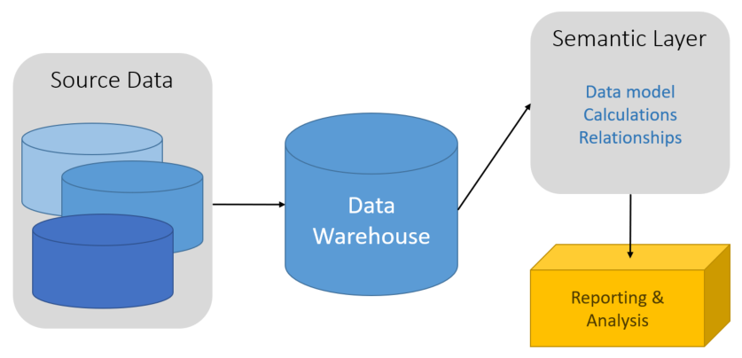

# Semantic Modeling

**In this article**

[About]()  
[Typical Requirements](#requirements)  
[Example use case](#usecase)  
[Where to go from here](#wheretogo)  

A semantic data model is a conceptual model that describes the meaning of data elements contained within. To put it another way, organizations have their own terms they use for things, sometimes with synonyms, or even different meanings for two different terms. An example of this is where an inventory database tracks a piece of equipment with an asset Id and a serial number, but a sales database might refer to the serial number as the asset Id. There would be no simple way to relate these values without some model that can describe the relationship. This is where semantic modeling can help. It makes it easier for end users to query data by providing a level of abstraction, making it so they do not need to know the underlying data structure and how aggregates and joins are formed. Also, usually columns are renamed to more business user-friendly names, helping users better understand the context and meaning of the data.

Semantic modeling is predominately used for read heavy scenarios, such as analytics and business intelligence (OLAP), as opposed to more write heavy transactional data processing (OLTP). This is mostly due to the nature of a typical semantic layer, where aggregation behaviors are set so reporting tools display them properly, business logic and calculations are defined, time-oriented calculations are included, and oftentimes data is pre-integrated for users (integrated from multiple sources). Traditionally, the semantic layer is placed over top of a data warehouse for these reasons.

There are two primary types of semantic models:

* Tabular: Uses relational modeling constructs (model, tables, columns). Internally, metadata is inherited from OLAP modeling constructs (cubes, dimensions, measures). Code and script use OLAP metadata.
* Multidimensional: Leverages traditional OLAP modeling constructs (cubes, dimensions, measures).

Relevant Azure Service: [Azure Analysis Services](https://azure.microsoft.com/services/analysis-services/)

### Example use case

Your organization has data stored in a large database that you want to make available to business users and customers to create their own reports and do some analysis. You can give your users this ability by giving them access to your database. Of course, there are several drawbacks to doing this, not the least of which is managing security on your production database for the users. Also, the design of your database, including the names of tables and columns may not be easy for a user to understand. They would need to know which tables to query, how those tables should be joined, and other business logic that needs to be applied to get the correct results. They would also need to know a query language like SQL to even get started. Most often this will lead to multiple users reporting the same metrics but with different results.

Another option is to encapsulate all the information needed into a semantic model which can be more easily queried by those users with a reporting tool of their choice. The data provided by the semantic model is pulled from a data warehouse, ensuring all users will see a single version of the truth. The semantic model will also provide friendly table and column names, relationships between tables, descriptions, calculations, and row level security.

### Typical Requirements

Semantic modeling and analytical processing tends to have the following requirements:

| Requirement | Description |
| --- | --- |
| Normalization: | Normalized |
| Uses Transactions: | No |
| Locking Strategy: | None |
| Updateable: | No |
| Appendable: | No |
| Workload: | Heavy reads |
| Indexing: | Multidimensional indexing |
| Datum size: | Medium to large sized |
| Model: | Multidimensional |
| Data shape: | Cube or Star/snowflake schema |
| Query flexibility: | Highly flexible |
| Scale: | Large |

## Where to go from here
Read Next: [Online Analytical Processing (OLAP) Solution Pattern](../solution-patterns/online-analytical-processing.md)

See Also:

Related Common Architectures
- [Relational data stores](./relational-data-stores.md)

Alternative Common Architectures
- [Non-relational and No-SQL data stores](./non-relational-data.md)

Related Solution Patterns
- Working with transactional data
    - [Online Transaction Processing (OLTP)](../solution-patterns/online-transaction-processing.md)
    - [Online Analytical Processing (OLAP)](../solution-patterns/online-analytical-processing.md)
    - [Data Warehousing](../solution-patterns/data-warehousing.md)

Related Technology Choices
- Transactional data stores
    - [Online Transaction Processing (OLTP) data stores](../technology-choices/oltp-data-stores.md)
    - [Online Analytical Processing (OLAP) data stores](../technology-choices/olap-data-stores.md)
    - [Data Warehouses](../technology-choices/data-warehouses.md)

