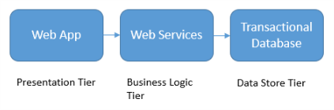

# Transactional Data 

**In this article**

[About]()  
[Typical Requirements](#requirements)  
[Best practices](#bestpractices)  
[Where to go from here](#wheretogo)  

Transactional data refers to data describing an event, always having a time dimension, some numerical values and references to other data. Transactional data is information an organization collects that tracks the interactions related to what the organization does. These interactions are typically business transactions such as payments received from customers or payments made to suppliers, products moving thru inventory, orders taken or services delivered.

 Transactional data has very strong consistency requirements and the transactional data stores that support it leverage transactions using pessimistic locking to ensure all data are 100% consistent for all users and processes. 

The most common deployment architecture utilizing transactional data is as the data store tier in a 3-tier architecture having a presentation tier, business logic tier and data store tier, or an [N-tier](https://docs.microsoft.com/azure/architecture/guide/architecture-styles/n-tier) architecture which may have multiple middle-tiers handling business logic. 

### Typical Requirements
Transactional data tends to have the following requirements:

| Requirement | Description |
| --- | --- |
| Normalization: | Highly normalized |
| Schema: | Schema on write, strongly enforced|
| Consistency: | Strong consistency, ACID guarantees |
| Integrity: | High integrity |
| Uses Transactions: | Yes |
| Locking Strategy: | Pessimistic or Optimistic|
| Updateable: | Yes |
| Appendable: | Yes |
| Workload: | Heavy writes, moderate reads |
| Indexing: | Primary and secondary indexes |
| Datum size: | Small to medium sized |
| Model: | Relational |
| Data shape: | Tabular |
| Query flexibility: | Highly flexible |
| Scale: | Small (MB's) to Large (a few TB's) |

## Where to go from here
Read Next: [Online Transaction Processing (OLTP) Solution Pattern](../pipeline-patterns/online-transaction-processing.md)

See Also:

Related Common Architectures
- [Relational data stores](./relational-data.md)

Alternative Common Architectures
- [Non-relational and No-SQL data stores](./non-relational-data.md)

Related Pipeline Patterns
- Working with transactional data
    - [Online Transaction Processing (OLTP)](../pipeline-patterns/online-transaction-processing.md)
    - [Online Analytical Processing (OLAP)](../pipeline-patterns/online-analytical-processing.md)
    - [Data Warehousing](../pipeline-patterns/data-warehousing.md)

Related Technology Choices
- Transactional data stores
    - [Online Transaction Processing (OLTP) data stores](../technology-choices/oltp-data-stores.md)
    - [Online Analytical Processing (OLAP) data stores](../technology-choices/olap-data-stores.md)
    - [Data Warehouses](../technology-choices/data-warehouses.md)

