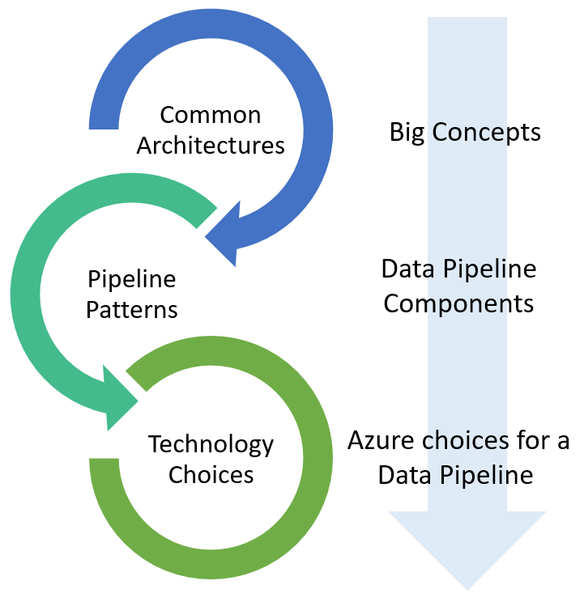
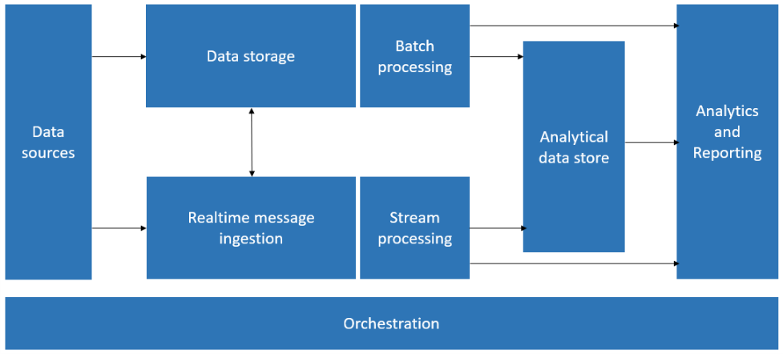
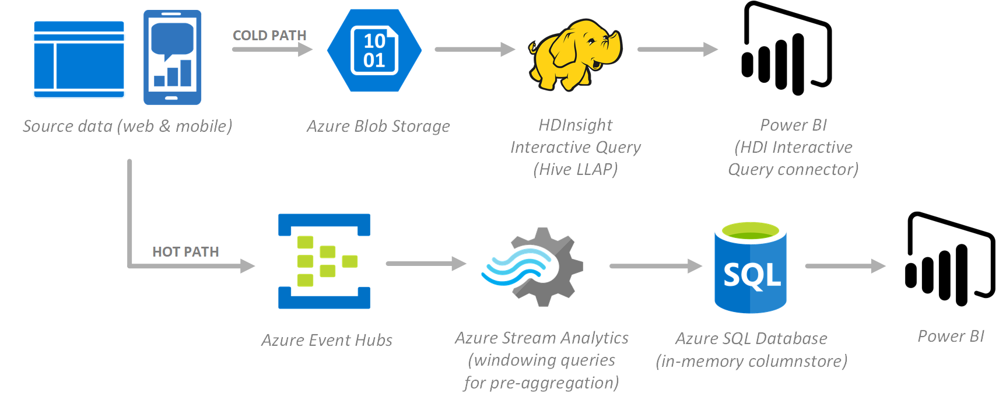
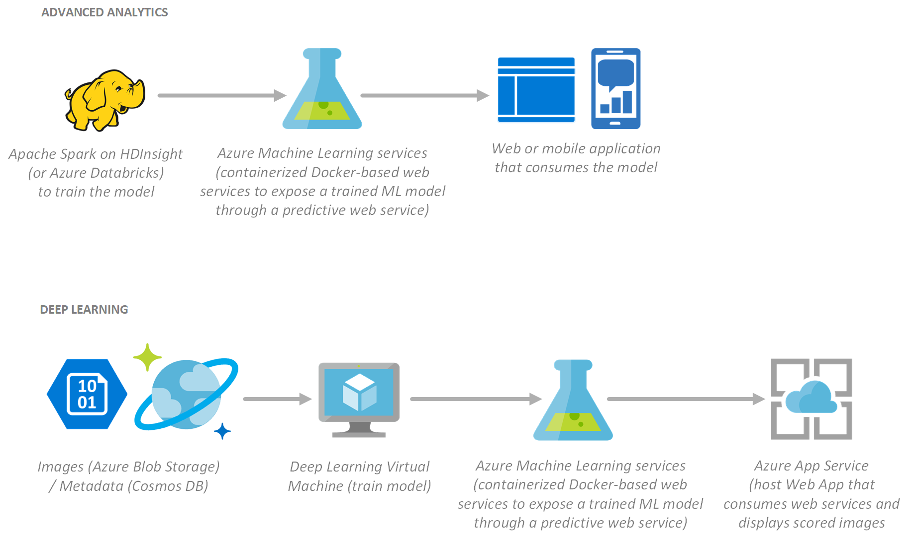
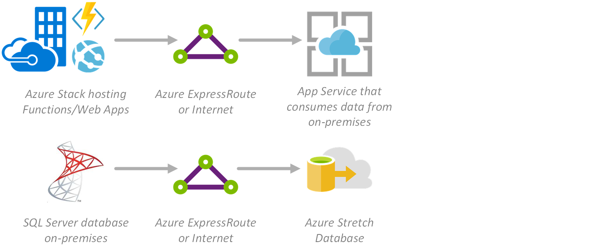
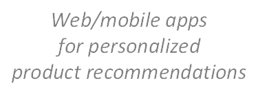
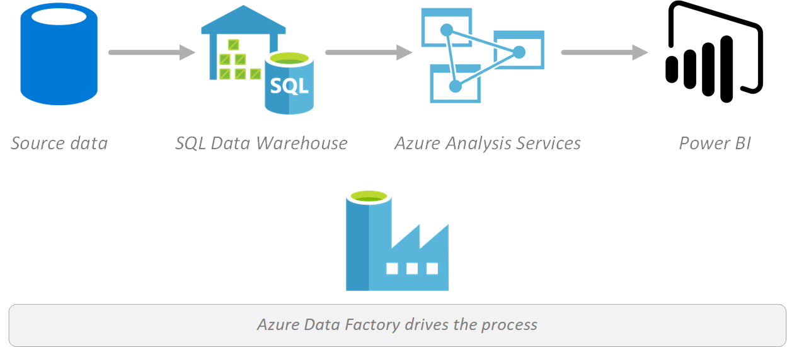
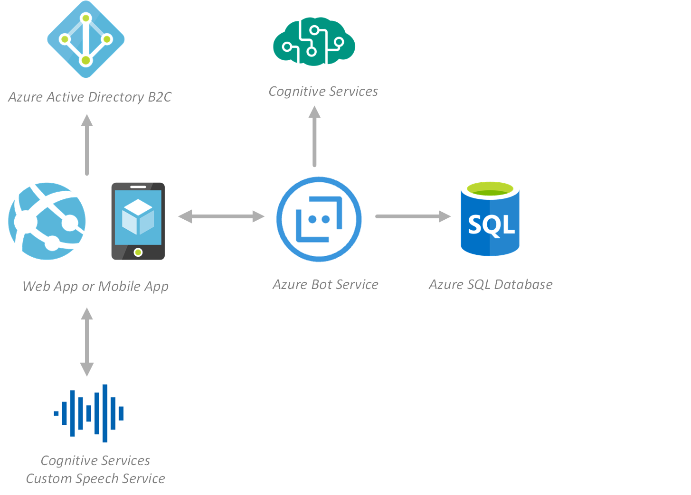
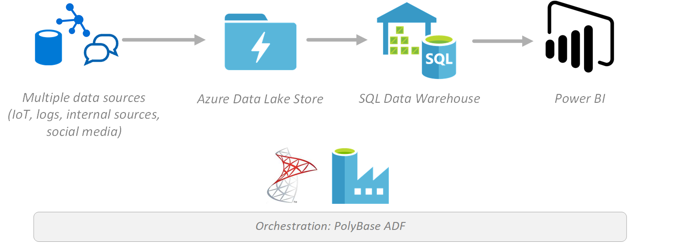
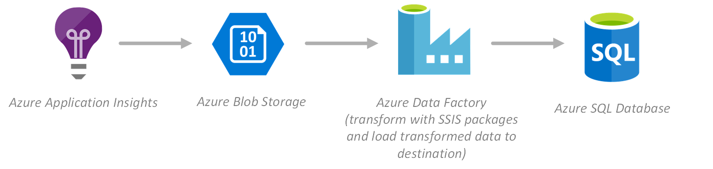

# Azure Data Architecture Guide

This guide presents a structured approach for designing data-centric solutions on Microsoft Azure. It is based on proven practices derived from customer engagements and is intended as an entry point for all data-related topics in Azure. The guide covers the big picture concepts in common data architectures and leads you to the pipeline patterns used by that architecture. The pipeline patterns are used to describe how the various processing and storage components fit together when handling the data. Finally, the technology choices will help you narrow the list of candidate Azure services--that are appropriate to your pipeline pattern--down to those services that are most appropriate to your specific requirements.

The [Implementation Examples](#implementation-examples) section below offers a snapshot of recommended services for our top customer scenarios. Each example shows you one possible technology implementation and leads you into the content to understand the right technology choices for your business.

# Introduction
The cloud is changing the way applications are designed, including how data is processed and stored. Instead of a single, general-purpose database that handles all of a solution's data, the _polyglot persistence_ approach is to use multiple, specialized databases and datastores&mdash;each optimized to provide specific capabilities needed by the solution. This approach is called polyglot persistence. The perspective on data in the solution changes as a result. It is no longer the case that there are multiple layers of business logic and a single data layer. Instead modern, polyglot persistence solutions are designed around the notion of a data pipeline that describes how data flows through a solution, where it's processed, where it's stored, and how it's consumed by the next component in the pipeline. 

The cloud is changing the way applications are designed, including how data is processed and stored. Instead of a single general-purpose database that handles all of a solution's data, the _polyglot persistence_ approach is to use multiple, specialized databases and datastores — each optimized to provide specific capabilities needed by the solution. This approach is called polyglot persistence. The perspective on data in the solution changes as a result. It is no longer the case that there are multiple layers of business logic and a single data layer. Instead modern, polyglot persistence solutions are designed around the notion of a data pipeline which describe how data flows through a solution, where it is processed, where it is stored and how its consumed by the next component in the pipeline. 

Owing to the fundamental importance of the data pipeline throughout modern data architectures, this guide demonstrates all data pipelines as variants of the following canonical data pipeline:  

# Implementation Examples

The following examples are technology implementations we have seen directly in our customer engagements. The examples can help lead you into the content to make the right technology choices for your business.

## On-Demand Big Data Analytics

Create cloud-scale, enterprise-ready Hadoop clusters in a matter of minutes for batch and real-time data processing. With Azure, you can build your entire big data processing and analytics pipeline from massive data ingest to world-class business intelligence and reporting, using the technology that's right for you.

COLD PATH: Source data (web, mobile) --> Azure Blob storage --> HDInsight Interactive Query (Hive LLAP) --> Power BI (HDI Interactive Query connector)

HOT PATH: Source data (web, mobile) --> Event Hubs --> Azure Stream Analytics (windowing queries for pre-aggregation) --> Azure SQL Server (in-memory columnstore) --> Power BI

### Highlighted services

* [Azure Storage blobs](https://docs.microsoft.com/azure/storage/blobs/storage-blobs-introduction)
* [Interactive Query (Hive LLAP) on HDInsight](https://docs.microsoft.com/azure/hdinsight/interactive-query/apache-interactive-query-get-started)
* [Power BI](https://docs.microsoft.com/power-bi/)
* [Azure Event Hubs](https://docs.microsoft.com/azure/event-hubs/)
* [Azure Stream Analytics](https://docs.microsoft.com/azure/stream-analytics/)
* [Azure SQL Database](https://docs.microsoft.com/azure/sql-database/)

### In this guide

* Common Data Architectures
    * [Big Data](./common-architectures/big-data.md)
    * [Advanced Analytics](./common-architectures/advanced-analytics.md)
* Pipeline Patterns
    * [Processing CSV and JSON files](./pipeline-patterns/processing-csv-and-json-files.md)
    * [Processing free-form text](./pipeline-patterns/processing-free-form-text.md)
* Technology Choices
    * [Batch processing](./technology-choices/batch-processing.md)
    * [Real-time processing](./technology-choices/real-time-processing.md)
    * [Data serving storage](./technology-choices/data-serving-storage.md)
    * [Data ingest](./technology-choices/data-ingest.md)
    * [Analysis, visualizations, and reporting](./technology-choices/analysis-visualizations-reporting.md)

## Advanced Analytics & Deep Learning

Go beyond historical reporting and exploratory analysis of your data by enabling predictive processing and automated decision making with Azure services like [Azure Machine Learning](https://docs.microsoft.com/azure/machine-learning/preview/overview-what-is-azure-ml) and [Apache Spark on HDInsight](https://docs.microsoft.com/azure/hdinsight/spark/apache-spark-jupyter-spark-sql). When you need to harness the power of multiple GPUs to build sophisticated deep neural architectures and train them on a large data set, get a jump start on the task with [Deep Learning Virtual Machines](https://docs.microsoft.com/azure/machine-learning/data-science-virtual-machine/deep-learning-dsvm-overview) and [CNTK](https://github.com/Microsoft/CNTK/wiki), the unified deep-learning toolkit by Microsoft.

ADVANCED ANALYTICS: Apache Spark on HDInsight (or Databricks?) to train the model --> Azure Machine Learning services (containerized Docker-based web services to expose trained ML model through a predictive web service) --> Web/mobile application that consumes the model

DEEP LEARNING: Images (Azure Blob storage) / Metadata (Cosmos DB) --> Deep Learning Virtual Machine (train model) --> Azure Machine Learning services (containerized Docker-based web services to expose trained ML model through a predictive web service) --> Azure App Services (host web app that consumes web services and displays scored images)

[Deep learning sample architecture](https://github.com/Azure/cortana-intelligence-product-detection-from-images/tree/master/technical_deployment).

### Highlighted services

* [Azure Machine Learning](https://docs.microsoft.com/azure/machine-learning/preview/overview-what-is-azure-ml)
* [Deep Learning Virtual Machines](https://docs.microsoft.com/azure/machine-learning/data-science-virtual-machine/deep-learning-dsvm-overview)
* [Apache Spark on HDInsight](https://docs.microsoft.com/azure/hdinsight/spark/apache-spark-jupyter-spark-sql)
* [Azure Storage blobs](https://docs.microsoft.com/azure/storage/blobs/storage-blobs-introduction)
* [HDInsight with Spark](https://docs.microsoft.com/azure/hdinsight/spark/apache-spark-overview)
* [Azure App Service](https://docs.microsoft.com/azure/app-service/)

### In this guide

* Common Data Architectures
    * [Big Data](./common-architectures/big-data.md)
    * [Advanced Analytics](./common-architectures/advanced-analytics.md)
* Pipeline Patterns
    * [Machine Learning at scale](./pipeline-patterns/machine-learning-at-scale.md)
* Technology Choices
    * [Options for processing CSV and JSON files](./technology-choices/csv-json-options.md)
    * [Data science and machine learning](./technology-choices/data-science-and-machine-learning.md)

## Hybrid

When you need hybrid on-premises and cloud options, nothing comes close to Azure. Use [Azure Stack](https://docs.microsoft.com/azure/azure-stack/azure-stack-poc) to deliver Azure services from your own datacenter, using the same tools in both environments for unmatched consistency, allowing you to deploy your data solution to the location that best meets your needs. Use [ExpressRoute](https://docs.microsoft.com/azure/azure-stack/azure-stack-connect-expressroute) for a private, dedicated and high speed connection that extends your on-premises network into Azure.

[Azure Stack hosting functions/web apps] - [express route or internet] -> [App Services that consume data from on-premises]
[SQL Server Database on-premises] - [express route or internet] -> [Azure stretch database]

[Hybrid sample architecture](https://docs.microsoft.com/en-us/azure/architecture/reference-architectures/hybrid-networking/expressroute-vpn-failover).

### Highlighted services

* [Azure Stack](https://docs.microsoft.com/azure/azure-stack/azure-stack-poc)
* [ExpressRoute](https://docs.microsoft.com/azure/expressroute/expressroute-introduction)
* [Azure App Service](https://docs.microsoft.com/azure/app-service/)
* [SQL Server Stretch Database](https://docs.microsoft.com/azure/sql-server-stretch-database/)

### In this guide

* Common Data Architectures
    * [Relational data](./common-architectures/relational-data.md)
* Pipeline Patterns
    * [Hybrid on-premises and cloud solutions](./pipeline-patterns/hybrid-on-premises-and-cloud.md)
    * [Online Transaction Processing (OLTP)](./pipeline-patterns/online-transaction-processing.md)
* Technology Choices
    * [Online Transaction Processing (OLTP) data stores](./technology-choices/oltp-data-stores.md)
    * [Data transfer](./technology-choices/data-transfer.md)
    * [Data ingest](./technology-choices/data-ingest.md)

## Clickstream Analysis

Engage with your customers and uncover insights from data generated by clickstream logs in real-time, using Azure. Rapidly ingest incoming data through [Event Hubs](https://docs.microsoft.com/azure/event-hubs/) (or leverage [Apache Kafka](https://docs.microsoft.com/azure/hdinsight/kafka/apache-kafka-get-started)), process it with [Spark](https://docs.microsoft.com/azure/hdinsight/spark/apache-spark-jupyter-spark-sql) streaming and Spark ML for predicting product recommendations, then use the Spark to [Azure Cosmos DB](https://docs.microsoft.com/azure/cosmos-db/) connector to save the processed data to Cosmos DB for global distribution to your customers, wherever they are.

Source (web/mobile) --> Event Hubs or Apache Kafka --> Apache Spark on HDInsight (Spark ML) -- Spark Connector --> Cosmos DB --> web/mobile apps for personalized product recommendations

### Highlighted services

* [Azure Event Hubs](https://docs.microsoft.com/azure/event-hubs/)
* [HDInsight with Apache Spark](https://docs.microsoft.com/azure/hdinsight/spark/apache-spark-jupyter-spark-sql)
* [HDInsight with Kafka](https://docs.microsoft.com/azure/hdinsight/kafka/apache-kafka-get-started)
* [Azure Cosmos DB](https://docs.microsoft.com/azure/cosmos-db/)

### In this guide

* Common Data Architectures
    * [Big Data](./common-architectures/big-data.md)
* Pipeline Patterns
    * [Processing CSV and JSON files](./pipeline-patterns/processing-csv-and-json-files.md)
    * [Processing free-form text](./pipeline-patterns/processing-free-form-text.md)
* Technology Choices
    * [Search technology choices](./technology-choices/search-options.md)
    * [Data ingest](./technology-choices/data-ingest.md)
    * [Natural language processing](./technology-choices/natural-language-processing.md)
    * [Real-time processing](./technology-choices/real-time-processing.md)

## Business Intelligence

Azure offers a rich data and analytics platform so you can build scalable BI and reporting solutions. Create rich, interactive reports with [Power BI](https://docs.microsoft.com/power-bi/) by having it connect to [Azure Analysis Services](https://docs.microsoft.com/en-us/azure/analysis-services/analysis-services-overview/), which uses a highly optimized in-memory engine to provide responses to queries against user-friendly semantic models, within a fraction of a second. The underlying data is provided by [Azure SQL Data Warehouse](https://docs.microsoft.com/azure/sql-data-warehouse/sql-data-warehouse-overview-what-is), which acts as a central repository of integrated data from one or more disparate sources.

Source data --> SQL Data Warehouse --> Azure Analysis Services --> Power BI

-----------------------------------------
    Azure Data Factory drives the process

### Highlighted services

* [Power BI](https://docs.microsoft.com/power-bi/)
* [Azure Analysis Services](https://docs.microsoft.com/en-us/azure/analysis-services/analysis-services-overview)
* [Azure SQL Data Warehouse](https://docs.microsoft.com/azure/sql-data-warehouse/sql-data-warehouse-overview-what-is)
* [Azure Data Factory]()

### In this guide

* Common Data Architectures
    * [Semantic modeling](./common-architectures/semantic-modeling.md)
    * [Data pipeline](./common-architectures/data-pipeline.md)
* Pipeline Patterns
    * [Data warehousing](./pipeline-patterns/data-warehousing.md)
    * [Online Analytical Processing (OLAP)](./pipeline-patterns/online-analytical-processing.md)
* Technology Choices
    * [Analysis, Visualizations, & Reporting](./technology-choices/analysis-visualizations-reporting.md)
    * [Data warehouses](./technology-choices/data-warehouses.md)
    * [Options for pipeline orchestration, control flow, and data movement](./technology-choices/pipeline-orchestration-data-movement.md)

## Intelligent Applications

Quickly add intelligence to your applications with [Cognitive Services](https://docs.microsoft.com/en-us/azure/#pivot=products&panel=cognitive), and coordinate automated interactions using [Azure Bot Service](https://docs.microsoft.com/bot-framework/bot-service-overview-introduction). This can save you months of creating and refining sophisticated algorithms to naturally interact with your users through speech, text, vision, knowledge, and search capabilities.

Azure Active Directory B2C   Cognitive Services 
   ^                              ^ 
   |                              | 
Web/mobile app <--> Azure Bot Service --> Azure SQL Database 
   ^ 
   | 
   v 
Custom Speech Service 

### Highlighted services

* [Azure App Service](https://docs.microsoft.com/azure/app-service/)
* [Azure SQL Database](https://docs.microsoft.com/azure/sql-database/)
* [Azure Bot Service](https://docs.microsoft.com/bot-framework/bot-service-overview-introduction)
* [Custom Speech Service](https://docs.microsoft.com/azure/cognitive-services/custom-speech-service/cognitive-services-custom-speech-home)
* [Azure Cognitive Services](https://docs.microsoft.com/en-us/azure/#pivot=products&panel=cognitive)
* [Azure Active Directory B2C](https://docs.microsoft.com/azure/active-directory-b2c)

### In this guide

* Common Data Architectures
    * [Advanced Analytics](./common-architectures/advanced-analytics.md)
* Pipeline Patterns
    * [Online Transaction Processing (OLTP)](./pipeline-patterns/online-transaction-processing.md)
* Technology Choices
    * [Online Transaction Processing (OLTP) data stores](./technology-choices/oltp-data-stores.md)
    * [Cognitive Services](./technology-choices/cognitive-services.md)

## Data Warehousing

Store data coming in from multiple sources into [Azure Data Lake Store](https://docs.microsoft.com/azure/data-lake-store/), in their native format. [SQL Data Warehouse](https://docs.microsoft.com/azure/sql-data-warehouse/sql-data-warehouse-overview-what-is) can directly query against the data with a combination of external tables and schema on read capabilities through [PolyBase](https://docs.microsoft.com/sql/relational-databases/polybase/get-started-with-polybase). Use [Azure Data Factory](https://docs.microsoft.com/en-us/azure/data-factory/) to store the data you need within your warehouse, and quickly analyze and visualize the combined data with [Power BI](https://docs.microsoft.com/power-bi/).

Multiple data sources (IoT, logs, internal sources, social media) --> Azure Data Lake Store --> SQL Data Warehouse --> Power BI 
                                                                      ----------------------------- 
                                                                        Orchestration: PolyBase/ADF 
                                                                      ----------------------------- 

### Highlighted services

* [Azure Data Lake Store](https://docs.microsoft.com/azure/data-lake-store/)
* [Azure SQL Data Warehouse](https://docs.microsoft.com/azure/sql-data-warehouse/sql-data-warehouse-overview-what-is)
* [Azure Data Factory](https://docs.microsoft.com/en-us/azure/data-factory/)
* [PolyBase](https://docs.microsoft.com/sql/relational-databases/polybase/get-started-with-polybase)
* [Power BI](https://docs.microsoft.com/power-bi/)

### In this guide

* Common Data Architectures
    * [Semantic modeling](./common-architectures/semantic-modeling.md)
    * [Relational data](./common-architectures/relational-data.md)
* Pipeline Patterns
    * [Data warehousing](./pipeline-patterns/data-warehousing.md)
    * [Online Analytical Processing (OLAP)](./pipeline-patterns/online-analytical-processing.md)
* Technology Choices
    * [Data warehouses](./technology-choices/data-warehouses.md)
    * [Data ingest](./technology-choices/data-ingest.md)
    * [Options for pipeline orchestration, control flow, and data movement](./technology-choices/pipeline-orchestration-data-movement.md)
    * [Data transfer](./technology-choices/data-transfer.md)
    * [Analysis, Visualizations, & Reporting](./technology-choices/analysis-visualizations-reporting.md)

## Extract, Transform, Load (ETL)

Capture web application logs and custom telemetry with [Application Insights](https://docs.microsoft.com/azure/application-insights/app-insights-overview), and create, schedule, and manage your ETL data pipeline using [Azure Data Factory](https://github.com/ZoinerTejada/azure-data-guide/blob/master/data-guide). Deploy your SSIS packages to Azure--with the [Azure-SSIS integration runtime](https://docs.microsoft.com/azure/data-factory/tutorial-deploy-ssis-packages-azure) (IR) in Azure Data Factory--to apply data transformation as a step in the ETL pipeline, before loading the transformed data into [Azure SQL Database](https://docs.microsoft.com/azure/sql-database/).

Application Insights --> Blob Storage --> Azure Data Factory (transform with SSIS packages and load transformed data to destination) --> Azure SQL Database

### Highlighted services

* [Azure Data Factory](https://github.com/ZoinerTejada/azure-data-guide/blob/master/data-guide)
* [Azure-SSIS integration runtime](https://docs.microsoft.com/azure/data-factory/tutorial-deploy-ssis-packages-azure)
* [Azure Storage blobs](https://docs.microsoft.com/azure/storage/blobs/storage-blobs-introduction)
* [Azure SQL Database](https://docs.microsoft.com/azure/sql-database/)
* [Application Insights](https://docs.microsoft.com/azure/application-insights/app-insights-overview)

### In this guide

* Common Data Architectures
    * [Data pipeline](./common-architectures/data-pipeline.md)
    * [Relational data](./common-architectures/relational-data.md)
* Pipeline Patterns
    * [Online Transaction Processing (OLTP)](./pipeline-patterns/online-transaction-processing.md)
    * [Monitoring data solutions](./pipeline-patterns/monitoring-data-solutions.md)
* Technology Choices
    * [Options for pipeline orchestration, control flow, and data movement](./technology-choices/pipeline-orchestration-data-movement.md)
    * [Data ingest](./technology-choices/data-ingest.md)

# How this guide is structured
This guide is structured so that your entry point to the content can be at the level of the common architecture, the pipeline pattern, or the technology choices for a particular pipeline scenario. 

At the end of each article a read next link is provided that you can follow to take a linear path through the content. In addition, links to alternate and related content are provided to guide you to material that provides additional perspective on the options, as well as provides links back up to the related parent topics and links to drill down into further detail. <!--This last sentence is confusing. What do you mean by links back up to the related parent topics? I looked at some docs and can't figure it out. Do you really need anything after options?-->

## Where to go from here
Read next:
[Common Data Architectures](./common-architectures/overview.md)

See also:

Alternative common architectures
- [Non-Relational Data](./common-architectures/non-relational-data.md)
- [Big Data](./common-architectures/big-data.md)

Related common architectures
- [Relational Data](./common-architectures/relational-data.md)
- [Transactional Data](./common-architectures/transactional-data.md)
- [Semantic Modeling](./common-architectures/semantic-modeling.md)
- [Advanced Analytics](./common-architectures/advanced-analytics.md)
- [Data Pipeline](./common-architectures/data-pipeline.md)
- [Interactive Data Exploration](./common-architectures/interactive-data-exploration.md)
