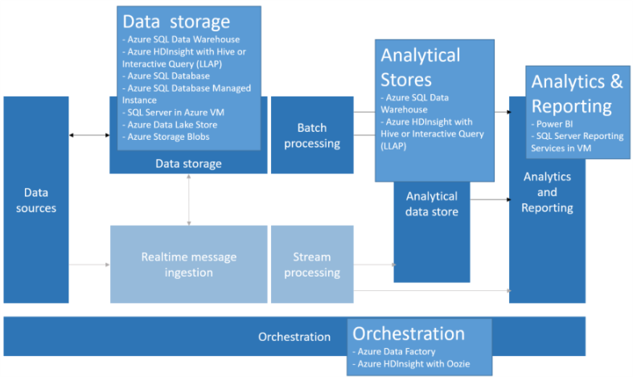

# Data warehousing 

[About]()  
[When to use this data architecture](#whentouse)  
[Benefits](#benefits)  
[Challenges](#challenges)  
[Data warehousing in Azure](#inazure)   
[Where to go from here](#wheretogo)  

A data warehouse is a central organizational, relational repository of integrated data from one or more disparate sources, across many or all subject areas. Data warehouses store current and historical data and are used for reporting and analysis of the data in different ways.

To move data into a data warehouse, it is extracted on a periodic basis from various sources that contain important business information. As the data is moved, it can be formatted, cleaned, validated, summarized, and reorganized. Alternately, the data can be stored in the lowest level of detail, with aggregated views provided in the warehouse for reporting. In either case, the data warehouse becomes a permanent storage space for data used for reporting, analysis, and forming important business decisions using business intelligence (BI) tools.

### Data Marts & Operational Data Stores
Owing to the complexities that surface with managing data at scale, in the enterprise, it is becoming less common to have a single data warehouse that strives to represent the entire data estate of the enterprise across all scenarios. Instead, smaller more focused data warehouses referred to as data marts are created that expose the desired data for analytics purposes. These data marts are populated using an orchestration process from data maintained in an operational data store, which acts as intermediary between the source transactional system and the data mart. The data managed by the operational data store is a cleaned version of the data present in the source transactional system, and typically a subset of the historical data that is maintained by the data warehouse or data mart. 

## When to use this architecture

Choose a data warehouse when you need to turn massive amounts of data from operational systems into a format that is easy to understand, current, and accurate so decisions can be made on the data. Data warehouses do not need to follow the same terse data structure you may be using in your operational/OLTP databases. You can use column names that make sense to business users and analysts, restructure the schema to simplify data relationships, and consolidate many tables, such as customers, into one. These steps help guide users who need to create ad-hoc reports, or create reports and analyze the data in BI systems, without the help of a DBA or data developer.

Consider using a data warehouse when you need to keep historical data separate from the source transaction systems, for performance reasons. Data warehouses make it easy to access historical data from multiple locations, by providing a centralized location using common formats, common keys, common data models, and common access methods.

## Benefits

Data warehouses are optimized for read access, resulting in faster report generation compared to running reports against the source transaction system. In addition, data warehouses provide the following benefits:

* All historical data from multiple sources can be stored and accessed from a data warehouse as the single source of truth.
* Improve data quality by cleaning up data as it is imported into the data warehouse, providing more accurate data as well as providing consistent codes and descriptions.
* A data warehouse eliminates the need for reporting tools to compete with the transactional source systems for query processing cycles. Fundamentally, this is because in transactional systems reads will block writes, but reads do not block other reads. By allowing your transactional system to focus predominantly on handling writes, and your data warehouse to satisfy the reads you enable users to analyze data faster, generate reports more easily, and slice-and-dice in ways that are more performant.
* A data warehouse can help consolidate data within a complex company that uses different software for different divisions.
* Data mining tools can help you find hidden patterns using automatic methodologies against data stored in your warehouse. While reporting tools can tell you where you have been, data mining tools can tell you where you are going.
* Data warehouses make it much easier to provide secure access to authorized users, while restricting access to others. There is no need to grant business users access to the source data, thereby removing a potential attack vector against one or more production transaction systems.
* Having a data warehouse makes it easier to create business intelligence solutions on top of the data it manages, such as [OLAP cubes](online-analytical-processing.md).

## Challenges

Properly configuring a data warehouse to fit the needs of your business can bring with it some of the following challenges:

* Committing the time required to properly model your business concepts. This is an important step, as data warehouses are information-driven, where concept mapping drives the rest of the project. This involves standardizing business-related terms and common formats (numeric, currency, dates, etc.), and restructuring the schema in a way that makes sense to business users but still ensures accuracy of data aggregates and relationships.
* Planning and setting up your data orchestration. Deciding how and how often to copy data from the source transactional system over to your data warehouse. Deciding on when, or if, to move historical data out of your operational data stores and into the warehouse.
* Coming up with a strategy to maintain and improve your data quality by cleaning your data as it is imported into your warehouse.

## Data warehousing in Azure 

In Azure, you may have one or more sources of data, whether from customer transactions, or from various business applications used by various departments. This data is traditionally stored in one or more [OLTP](online-transaction-processing.md) databases. The data could be persisted in other storage mediums such as network shares, Azure Storage Blobs, or a [data lake](../common-architectures/big-data.md#datalake). The data could also be stored by the data warehouse itself, such in Azure SQL Data Warehouse or by a relational database like Azure SQL Database. The purpose of the analytical data store layer is to satisfy queries issued by analytics and reporting tools against the data warehouse or data mart. In Azure this analytical store capability can be met with Azure SQL Data Warehouse, with Azure HDInsight using Hive or Interactive Query. Because there is a requirement to move and transform data on a regular basis, you will need some level of orchestration to periodically move or copy data from your data storage to the data warehouse, which can be accomplished with Azure Data Factory or Oozie on Azure HDInsight.

Related services:

* [Azure SQL Database](https://docs.microsoft.com/azure/sql-database/)
* [SQL Server in a VM](https://docs.microsoft.com/sql/sql-server/sql-server-technical-documentation)
* [Azure Data Warehouse](https://docs.microsoft.com/azure/sql-data-warehouse/sql-data-warehouse-overview-what-is)
* [Apache Hive on HDInsight](https://docs.microsoft.com/azure/hdinsight/hadoop/hdinsight-use-hive)
* [Interactive Query (Hive LLAP) on HDInsight](https://docs.microsoft.com/azure/hdinsight/interactive-query/apache-interactive-query-get-started)

## Where to go from here
Read Next:
[Data warehouse technology choices](../technology-choices/data-warehouses.md)

See Also:

Related Technology Choices
- Transactional data stores
    - [Online Transaction Processing (OLTP) data stores](../technology-choices/oltp-data-stores.md)
    - [Online Analytical Processing (OLAP) data stores](../technology-choices/olap-data-stores.md)