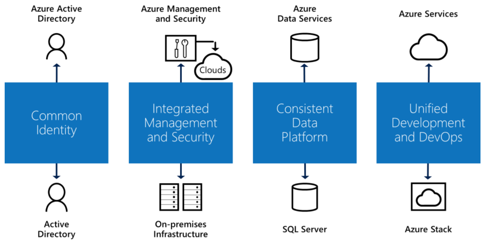

# Hybrid On-Premises and Cloud Solutions

[About]()  
[When to use this data architecture](#whentouse)  
[Benefits](#benefits)  
[Challenges](#challenges)  
[Hybrid in Azure](#inazure)   
[Where to go from here](#wheretogo)  

There has been an upward trend for the past several years of businesses moving to the cloud. The reasons are numerous, given the benefits cloud architectures bring, such as eliminating the need to procure and maintain physical servers, taking advantage of the latest innovations unique to the cloud, and virtually endless scalability of your solutions. But on-premises datacenters also have an important role to play, both today and in the future. For many organizations, integrating these two to create a hybrid cloud is essential.

Hybrid cloud uses compute or storage resources on your on-premises network and in the cloud. You can use hybrid cloud as a path to migrate your business and its IT needs to the cloud or integrate cloud platforms and services with your existing on-premises infrastructure as part of your overall IT strategy.

To achieve a hybrid cloud, you need a way to connect your on-premises datacenters with the cloud. But basic connectivity isn't enough. A hybrid cloud should go beyond this, providing a complete set of consistent services. You need access to a broad range of cloud and on-premises technologies that work together in a coherent way.

There are four components of a true hybrid cloud, each of which brings significant benefits. They are the following:

* **Common identity for on-premises and cloud applications**: This improves user productivity by giving your users single sign-on to all of their applications.
* **Integrated management and security across your hybrid cloud**: This enables a cohesive way to monitor, manage, and help secure your environment, giving you increased visibility and control.
* **A consistent data platform for your datacenter and the cloud**: This gives you data portability, combined with seamless access to on-premises and cloud data services for deep insight into your data.
* **Unified development and DevOps across the cloud and your on-premises datacenters**: This lets you move applications between the two environments as needed, and it also improves developer productivity, since both places now have the same development environment.

Taken together, these four requirements provide consistent experiences for data professionals, developers, IT managers, and users. Because you'll have information both in the cloud and on-premises, it makes sense to have a common approach to working with data in both places. This consistency lets your  use the same tools and skills throughout your environment.

In this article, we will focus on the consistent data platform for your datacenter and the cloud.

### Network shares

In a hybrid cloud architecture, it is common for business to keep newer files on-premises while archiving older files to the cloud. The benefits of doing this are twofold. On one hand, it keeps the newest or most commonly accessed files within your network to reduce bandwidth usage and reduce file access times. On the other hand, this approach helps you manage unexpected local storage growth. This is sometimes called file tiering, where there is a seamless listing of and access to both on-premises and cloud-hosted files.

Other times, organizations may wish to lift and shift their network shares to the cloud, which would be desirable, for instance, if your applications that access them are also located on the cloud. This procedure can be done using some level of [data orchestration](../technology-choices/pipeline-orchestration-data-movement.md).

### On-premises data stores

On-premises data stores include databases, lists, and files. There may be several reasons to keep these local. You may choose to leverage your existing on-premises investments as you migrate workloads and applications to the cloud. Or there may be regulations or policies that do not permit moving specific data or workloads to the cloud.

Some of the biggest factors influencing the placement of applications, or components of applications, between on-premises datacenters or public cloud, are those surrounding the application data. Data sovereignty, privacy, and/or security concerns will in some countries favor on-premises placement, either of the full application or the key application components storing application data. Often these concerns can be more perception than actual, and undermine the opportunity to take advantage of the real benefits of cloud hosting, so due diligence is required.

Some of the important considerations in placing application data in a public cloud include:

* **Cost advantages**: The cost of storage in public clouds such as Azure can be significantly lower than the cost of maintaining storage with similar characteristics in an on-premises datacenter. Of course, many companies will have existing investments in high-end SANs, so these cost advantages may not reach full fruition until existing hardware ages out.
* **Scale agility**: Planning for and managing data capacity growth in an on-premises environment can be challenging, particularly for applications where data growth is difficult to predict. For these applications, cloud-based placement can take advantage of the capacity-on-demand and virtually unlimited storage available. In contrast, applications that consist of relatively static sized datasets are equally suitable for placement on-premises or in public cloud (on this dimension). <!--I have no idea what that parenthetical means or refers to. Will it make sense to the reader?-->
* **Data assurance**: When placing applications in public clouds such as Azure, protection of data through redundancy is provided automatically with multiple copies of data placed across disks, racks, and even geographic regions. Similar levels of protection can be provided in on-premises infrastructures through data replication technologies where multiple datacenters are available. In hybrid environments, these same technologies can be used to replicate between on-premises and cloud-based data stores.

### Extending data stores to the cloud

On-premises data stores can be extended to the cloud in a number of ways within a hybrid cloud architecture. One option is to have on-premises and cloud replicas. This can help you achieve a high level of data assurance and fault tolerance, and may require making some changes to your applications to connect to the appropriate data store in the event of a failover.

Another option is to move a portion of the data to cloud storage, while keeping the more current or more highly accessed data on-premises. This method can provide a more cost-effective option for long-term storage, as well as improve data access response times by reducing your operational data set.

In situations where you desire to keep all of your data on-premises, yet harness the compute power and accessibility of the cloud, you could consider using a hybrid application. To do this, you would host your application (compute, web/mobile, data, analytics, IoT, media, and so on) in the cloud and connect it to your on-premises data store over a secure connection.

## When to use this architecture

There are several strong cases for hybrid cloud, such as meeting industry regulations for how and where data can be stored. When connectivity and latency issues have a performance impact on your ability to transfer data between your on-premises data stores and the cloud, you may opt to maintain select data to work with locally. A hybrid approach to cloud could make sense for using existing on-premises technology as an asset in digital transformation as opposed to treating them as purely legacy investments. Once you realize that cloud doesn't have to be an all or nothing prospect, there are many ways to harness the power of the cloud while maximizing your current investments.

## Benefits

Using a hybrid on-premises and cloud solution offers the following benefits:

* Use hybrid cloud as a transition from locally hosted assets to the benefits gained from hosting your data and applications in the cloud.
* Keep data on-premises when regulations or policies do not permit moving specific data or workloads to the cloud.
* Keep data that is sensitive to connectivity and latency issues, on-premises for improved performance.
* Continue to use existing on-premises technology and procedures, while capitalizing on the strength and flexibility of the cloud as appropriate for other tasks.
* Improve disaster recovery and fault tolerance by replicating data and services between on-premises and cloud environments.
* Reduce latency between your on-premises data center and remote locations by hosting part of your architecture in geographic regions within the cloud.
* Minimizing cost by leveraging low cost public cloud storage and capacity on demand.
* Reducing operational risk by cloud-based backup and/or disaster recovery strategies.
* Leveraging public cloud-based services to extend management capabilities.

## Challenges

Establishing a hybrid architecture can include <!--Not sure this is the best word choice, but the common meanings of surface may confuse ESL readers.--> some of the following challenges:

* Making security, management, your data platform, and development consistent between on-premises and cloud, avoiding duplication of work and wasting valuable resources. Synchronizing differences between environments can be painful and costly.
* Creating a reliable, low latency and secure data connection between your on-premises and cloud environments.
* Replicating your data and modifying your applications and tools to use the correct data stores within each environment.

## Hybrid in Azure

Enabling a consistent hybrid cloud experience across on-premises and the cloud has long been a goal of Azure. As the diagram below shows, Azure provides consistent solutions to the four areas covered at the beginning of this topic: identity, management and security, data platform, and development/DevOps.

Examples of these four areas include the following:

* Azure Active Directory works with your on-premises Active Directory to provide common identity for your users.
* Azure provides integrated management and security services for both cloud and on-premises infrastructure.
* Azure data services combine with SQL Server to create a consistent data platform.
* Azure services in the cloud combined with Azure Stack <!--I removed the link becasue it's in the first sentence below and that's where people are more likely to explore from.--> on-premises provide unified development and DevOps.

### Azure Stack

For the most complete hybrid cloud solution option available today, consider using [Azure Stack](https://docs.microsoft.com/azure/azure-stack/). In essence, it is an extension of Azure that runs on-premises. This helps maintain consistency between on-premises and Azure by using identical tools and requiring no code changes. The goal is that most applications and services that are certified for Azure will work on Azure Stack.

The following are some use cases for Azure and Azure Stack:

* **Edge and disconnected solutions**: Customers can address latency and connectivity requirements by processing data locally in Azure Stack and then aggregating in Azure for further analytics, with common application logic across both. There’s lots of customer interest in this edge scenario across different contexts, including factory floors, cruise ships, and mine shafts.
* **Cloud applications that meet varied regulations**: Customers can develop and deploy applications in Azure, with full flexibility to deploy on-premises on Azure Stack to meet regulatory or policy requirements, with no code changes needed. Illustrative application examples include global audit, financial reporting, foreign exchange trading, online gaming, and expense reporting. Many customers are looking to deploy different instances of the same application to Azure or Azure Stack, based on business and technical requirements. While Azure meets most requirements, Azure Stack complements the deployment approach where needed.
* **Cloud application model on-premises**: Customers can use Azure web services, containers, serverless, and microservice architectures to update and extend existing applications or build new ones. You can use consistent DevOps processes across Azure in the cloud and Azure Stack on-premises. We’re seeing broad interest in application modernization, including for core mission-critical applications.

### SQL Server data stores

Using [Azure SQL Database](https://docs.microsoft.com/azure/sql-database/), a PaaS data service, brings more possibilities. Because Azure SQL Database is based on SQL Server, applications can access data in the same way with both technologies. Azure SQL Database can also be combined with SQL Server in useful ways. For example, the [SQL Server Stretch Database](https://docs.microsoft.com/sql/sql-server/stretch-database/stretch-database) feature lets an application access what looks like a single table in a SQL Server database while some or all rows of that table might be stored in Azure SQL Database. This technology automatically moves data that's not accessed for a defined period of time to the cloud. Applications reading this data are unaware that any of it has been moved to the cloud.

Hybrid cloud can be used as part of your migration strategy. For example, you can use the migration wizard built into SQL Server Management Studio to help move on-premises SQL Server applications to Azure IaaS virtual machines. If you would like to migrate from SQL Server to Azure SQL Database with minimal downtime, consider using [Transactional Replication](https://docs.microsoft.com/sql/relational-databases/replication/transactional/transactional-replication). Transactional replication involves three main components. They are the publisher, the distributor, and the subscriber. Transactional replication starts with a snapshot of the original database. After the initial snapshot is created, all changes to published objects and data in the original database (the publisher) are propagated to the new database (the subscriber) by the distributor, guaranteeing transactional consistency. With transactional replication, you will suffer little to no downtime, assuming you're using concurrent snapshots. With concurrent snapshots, you can continue using your original database while the snapshot is being created. After this, transactional replication will keep the subscriber up to date with minimal latency, so you can switch to using your new database in the cloud whenever you want. Note that in the case of highly intensive workloads, downtime may still be advised for snapshot creation, in order to prevent resource contention from affecting the application.

> You can possibly lower the cost of migration by bringing your on-premises licenses to Azure through the [Azure Hybrid Use Benefit](https://docs.microsoft.com/azure/virtual-machines/windows/hybrid-use-benefit-licensing). Similarly, license mobility provides the flexibility to deploy existing SQL Server licenses with Software Assurance in the cloud without additional fees.

If you plan on maintaining your data stores both on-premises and in the cloud, on the other hand, there are a few options available to you when using SQL Server. One option is to run SQL Server in an Azure IaaS virtual machine. You might do this as part of moving an entire application to the cloud to lower your costs, for example, or perhaps to create a development environment for applications that are deployed on-premises. You can now [use Microsoft Azure Blob Storage service for backups and restores](https://docs.microsoft.com/sql/relational-databases/backup-restore/sql-server-backup-and-restore-with-microsoft-azure-blob-storage-service) with your on-premises SQL Server. Your options are to manage your backups to Azure, perform file-snapshot backups for database files in Azure Blob Storage, or let SQL Server manage backups to Azure. This capability gives you limitless off-site storage, and the ability to share the same backups between your on-premises SQL Server and SQL Server running in a Microsoft Azure Virtual Machine. Whatever the reason, you can use the same database technology throughout your hybrid cloud. This makes it easier to move your data and applications as needed to respond to changing business requirements.

Maintaining data stores on-premises and in the cloud can be challenging when you desire to keep the data synchronized. You can address this with [SQL Data Sync](https://docs.microsoft.com/azure/sql-database/sql-database-sync-data), a service built on Azure SQL Database that lets you synchronize the data you select, bi-directionally across multiple Azure SQL databases and SQL Server instances. While Data Sync makes it easy to keep your data up-to-date across these various data stores, it should not be used for disaster recovery or for migrating from on-premises SQL Sever to Azure SQL Database.

When you need disaster recovery and business continuity, combine the power of the cloud with SQL Server [AlwaysOn Availability Groups](https://docs.microsoft.com/sql/database-engine/availability-groups/windows/overview-of-always-on-availability-groups-sql-server). An availability group has two (or more) instances of SQL Server running on two different systems. The AlwaysOn technology automatically replicates changes to data across these systems. If the primary fails, the secondary can automatically take over, letting applications that use this database continue running. This kind of replication is essential for mission-critical workloads, and AlwaysOn supports scenarios with a low recovery time objective (RTO). Running the secondary server in the cloud can save you money and time. This secondary can also be
made readable to help you scale access to data. For example, a readable secondary could be located in an Azure datacenter that's closer to salespeople using a mobile business intelligence app.

### Network shares and file-based data stores

[Azure StorSimple](https://docs.microsoft.com/azure/storsimple/) offers the most complete integrated storage solution for managing storage tasks between your on-premesis devices and Azure cloud storage, perfect for hybrid cloud scenarios. StorSimple is an efficient, cost-effective, and easily manageable storage area network (SAN) solution that eliminates many of the issues and expenses associated with enterprise storage and data protection. It uses the proprietary StorSimple 8000 series device, integrates with cloud services, and provides a set of management tools for a seamless view of all enterprise storage, including cloud storage.

Another way to use on-premises network shares alongside cloud-based file storage is with [Azure Files](https://docs.microsoft.com/azure/storage/files/storage-files-introduction). Azure Files offers fully managed file shares that you can access with the standard [Server Message Block](https://msdn.microsoft.com/library/windows/desktop/aa365233.aspx?f=255&MSPPError=-2147217396) (SMB) protocol (sometimes referred to as CIFS). This means that you can mount Azure Files as a file share on your local machine (Windows, macOS, or Linux), allowing you to use familiar operation system tools like Storage Explorer to access the files in your file share from anywhere in the world. This also makes accessing these files seamless from existing applications that access files on your local system or network shares, likely without requiring code changes.

Keep your Azure File shares in-sync with your on-premises Windows Servers with [Azure File Sync](https://docs.microsoft.com/azure/storage/files/storage-sync-files-planning). One major benefit of Azure File Sync is the ability to tier files between your on-premises file server and Azure Files. This enables you to keep only the newest and most recently accessed files locally without sacrificing the ability to see and access the entire namespace through seamless cloud recall. With Azure File Sync, you can effectively transform your Windows File Server into an on-premises tier of Azure Files. Since cloud tiering moves old and infrequently accessed files to Azure, it effectively helps you make unpredictable storage growth predictable. When disasters strike, Azure File Sync can help. Simply set up a new Windows Server, install Azure File Sync, and the namespace is nearly instantly synced down as your cache is rebuilt.

Another option is to use [Azure Managed Disks](https://docs.microsoft.com/azure/virtual-machines/windows/managed-disks-overview), but you would also need to attach the disk to a virtual machine that's running in Azure, adding an additional cost to your storage solution. Additionally, this disk could only be attached to one VM at a time. You could also use Azure Blob storage, but it does not provide the SMB protocol that would make it more like working with a network share and thus may require application changes in order to support file operations. For a more in-depth description of the differences between Azure Files, Azure Disks, and Blob storage, see [Deciding when to use Azure Blob storage, Azure Files, or Azure Disks](https://docs.microsoft.com/en-us/azure/storage/common/storage-decide-blobs-files-disks).

### Migrating your applications to the cloud

The principals that pertain to a consistent hybrid cloud can make migrating your data-enabled applications significantly easier. For example, [Azure Site Recovery](https://docs.microsoft.com/azure/site-recovery/) can help with migration as well as disaster recovery because it can create new instances of on-premises applications on Azure. Rather than manually moving applications to the cloud, you can rely on Azure Site Recovery to do this and to help you cut over to the new cloud instances.

### Network connectivity

Designing the communication channels between traditional on-premises infrastructure and public clouds is fundamental to being able to successfully enable hybrid cloud scenarios. There are several approaches to extend an on-premises network to public clouds (such as Azure), each with different strengths and weaknesses. The more seamless the interconnectivity in hybrid cloud environments, the better the ability for hybrid applications and workloads to take advantage of the respective strengths of different clouds.

Key considerations when choosing between the different connectivity options described in this section include understanding bandwidth and latency needs, security implications, reliability goals, and ensuring that you have the operational agility to quickly adapt network configurations to meet changing needs.

There are several choices to evaluate when designing connectivity from your on-premises environments to public clouds such as Azure. [How do I choose?](https://docs.microsoft.com/azure/architecture/reference-architectures/hybrid-networking/considerations)

#### Virtual private networks (VPN) using Internet gateways

The key benefits of using VPN connections to public clouds include the familiarity of the technology and the relatively low cost compared to more dedicated connections. This option is best suited for connecting your on-premises network to your IaaS cloud infrastructure composing of VNETs and VMs within.

There are two key VPN variations to consider:

* **Point-to-site connection**: This is an individually configured connection between an on-premises client and a virtual network in a public cloud. It imposes no requirement on the client side for a dedicated VPN device. Connection is established manually over the public Internet. When connecting from an on-premises client to Azure, the connection is secured using Secure Sockets Tunneling Protocol (SSTP).
* **Site-to-site connection**: This is a secure connection between an on-premises site and a virtual network in a public cloud. It requires a VPN device to be configured at your on-premises site that creates a connection to a VPN gateway running in the cloud, secured using Internet Protocol Security (IPsec). Once the connection is established, resources in both the on-premises site and the cloud virtual network are able to communicate seamlessly with each other.

#### Dedicated connections using ExpressRoute

[Azure ExpressRoute](https://docs.microsoft.com/azure/expressroute/) enables a dedicated Layer 3 connection between an on-premises environment and the Azure public cloud. The key benefits of dedicated connections include the improved traffic isolation and increased predictability of performance of a private connection. Network traffic is not as exposed to the potential risks of flowing over the public Internet, or to the potential performance impact of noisy neighbors. ExpressRoute connections provide built-in redundancy to help ensure high availability, and they include a number of controls to manage quality-of-service (QoS) for different traffic types. Microsoft uses an industry standard border gateway routing protocol (BGP) to exchange routes between your network, your private virtual networks in Azure, and Microsoft public cloud addresses.

There are three key dedicated connection topologies to consider:

* **Point-to-point Ethernet connection**: This is a Layer 2 or Layer 3 connection provided by your service provider, directly from your on-premises edge to the Microsoft Azure cloud.
* **Any-to-any connection**: This is a dedicated IPVPN (MPLS VPN), providing site-to-site connection between on-premises datacenters and the Microsoft Azure cloud. In this configuration, the Microsoft Azure cloud is like any other WAN connection between your on-premises environment and a remote site.
* **Colocation at a cloud exchange**: If your on-premises infrastructure is located in an ExpressRoute provider’s edge (typically referred to as an Exchange Provider), then they can provide a Layer 2 or managed Layer 3 connection between your on-premises network edge and Azure. <<!--The style guide says not to use Azure cloud, and Microsoft isn't necessary since it's our offering.-->>

An ExpressRoute circuit connects to the Azure region where the circuit is provisioned and paired with the Azure edge infrastructure. ExpressRoute supports global routing to all regions when the circuit is upgraded to the [Premium SKU](https://azure.microsoft.com/pricing/details/expressroute/). This enables highly resilient, multi-region deployment topologies.

Compare your options with a set of [Hybrid network reference architectures](https://docs.microsoft.com/azure/architecture/reference-architectures/hybrid-networking/index).

## Where to go from here
Read next:
[Pipeline Orchestration, Control Flow, and Data Movement technology choices](../technology-choices/pipeline-orchestration-data-movement.md)

See also:

Related technology choices
- [Online Transaction Processing (OLTP) data stores](../technology-choices/oltp-data-stores.md)
- [Data Serving Storage](../technology-choices/data-serving-storage.md)
- [Data Transfer](../technology-choices/data-transfer.md)
- [Data Ingest](../technology-choices/data-ingest.md)