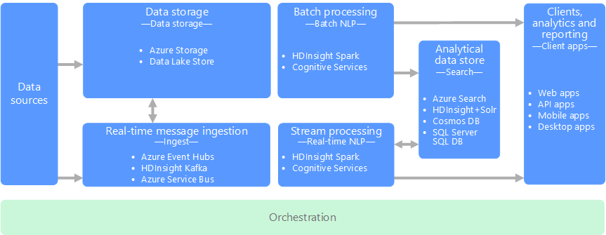

# Processing Free-form Text

[About]()  
[When to use this data architecture](#whentouse)  
[Benefits](#benefits)  
[Challenges](#challenges)  
[Processing free-form text in Azure](#inazure)   
[Where to go from here](#wheretogo)  

Free-form text processing is performed against documents containing paragraphs of text, typically for the purpose of supporting search, but is also used to perform other natural language processing (NLP) tasks such as sentiment analysis, topic detection, language detection, key phrase extraction, and document categorization.

In the case of search, a query is built containing the text the documents need to contain and a result set is produced consisting of a list of documents sorted by how well the content of each document matches the search criteria. The query is executed against a specialized index that is precomputed against the collection of documents. The result set may also include the context in which the the document matches the criteria, which enables hit-highlighting in search results user interfaces that extract and highlight the matching phrase in the document. 

In addition to search, free-form text processing is used for classifying documents, such as labeling documents as sensitive or spam to support subsequent processing or search. 

Another use for free-form text processing is summarization of text content by identifying the entities present in the document. On their own, the important entities in the document can be used to tag the documents with keywords enabling search and retrieval. The entities might themselves be combined into topics, and the summarization instead describes the important topics present in each document. The detected topics may be used to categorize the documents for navigation, or to enumerate related documents given a selected topic. Alternately, the text may be scored for sentiment to assess the positive or negative tone of the document. These approaches use many techniques from natural language processing, such as: <!--Other lists have a space between the text and the bullets, they also have the terms being defined in bold so I've made this match.-->

- **Tokenizer**: Splitting the text into words or phrases.
- **Stemming & lemmatization**: normalizing words so that that different forms map to the canonical word with the same meaning. For example, "running" and "ran" map to "run." 
- **Entity extraction**: identifying subjects in the text.
- **Part of speech detection**: identifying text as a verb, noun, participle, verb phrase, and so on.
- **Sentence boundary detection**: detecting complete sentences within paragraphs of text.

## When to use this architecture
Use free-form text processing when your text data arrives in an unstructured format and you want to enable full-text search or perform some additional natural language processing against it. Generally this means it arrives in a document format, where applying a schema to the data would be difficult or impossible.

## Benefits
Free-form text processing has the benefit that it can produce useful, actionable data from large amounts of noisy text data. The results can, in effect, give your unstructured documents a well-defined and queryable structure.

## Challenges
The approach utilized to process free-form text produces a few challenges:

- The processing of a collection of free-form text documents is typically computationally resource intensive, as well as being time intensive.
- The querying of free-form processed data tends to trade precision for robustness. For example, search indexes are built with lemmatization and linguistic stemming so that queries for "run" will match documents that contain "ran" and "running."
- In the absence of a standardized document format, it can be very difficult to achieve consistently accurate results using free-form text processing to extract specific facts from a document. For example, think of a text representation of an invoice&mdash;it can be difficult to build a process that correctly extracts the invoice number and invoice date for invoices across any number of vendors.

## Processing free-form text in Azure
In Azure, various services support the indexing of free-form text data (for example, provided a document they process the document and populate the index that can later be used for searching thru the document collection).

### Processing free-form text for search in Azure
In most situations the source text documents are loaded into object storage such as that provided by Azure Storage or Azure Data Lake Store. The primary exception to this is when using full text search within SQL Server or Azure SQL Database. In this case, the document data is loaded into tables managed by the database.

Once stored, the documents are processed in a batch to create the index. All services have some mechanism that, provided a path to the collection of documents, will populate a search index. Azure Search provides indexers that can automatically populate the index for provided documents ranging from plain text, to Excel and PDF formats. On HDInsight, Apache Solr can index binary files of many types, including plain text, Word, and PDF. Full text search in SQL Server populates the index from text, binary, or XML data stored within the same database. 

Once the index is constructed, services typically expose a search interface by means of a REST API. This is true for Azure Search, ElasticSearch, and HDInsight with Solr. Documents indexed by SQL Server or Azure SQL Database are searched using T-SQL queries. 

 <!--VM should be spelled out as virtual machine. There should be a comma after analytics in the far right box.-->

### Processing free-form text using natural language processing in Azure
When utilizing NLP to extract information and insight from free-form text, the starting point is typically the raw documents stored within object storage such as Azure Storage or Azure Data Lake Store. 

The actual processing that applies NLP techniques varies based on the desired outcome, but in terms of the pipeline may be applied in a batch or real-time fashion. For example, sentiment analysis can be used against blocks of the text to produce a sentiment score, and can typically done either in batch against data in storage or in real time against smaller data flowing thru messaging services. 

 <!-- see previous comment about comment after analytics. This should match whatever you decided.-->

## Where to go from here
Read next:
[Search technology choices](../technology-choices/search-options.md)

See also:

Related pipeline patterns
- Handling Unstructured Data
    - [Processing CSV and JSON files](./processing-csv-and-json-files.md)

Related technology choices
- [Natural Language Processing](../technology-choices/natural-language-processing.md)