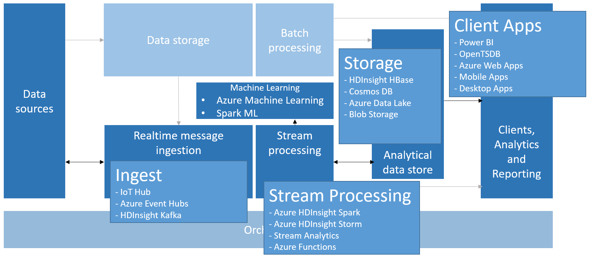
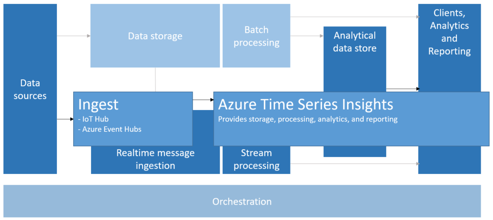

# Time Series

[About]()  
[When to use this data architecture](#whentouse)  
[Benefits](#benefits)  
[Challenges](#challenges)  
[Time series in Azure](#inazure)   
[Where to go from here](#wheretogo)  

Time series data represents how an asset or process changes over time. It’s unique in that it has a timestamp and time is most meaningful as an axis. Time series data typically arrives in order of time and is usually treated as an insert rather than an update to your database. Because of this, change is measured over time, enabling you to look backward and to predict future change. As such, time series data is best visualized with scatter or line charts.

Some examples of time series data are:

- Stock prices captured over time to detect trends, review past performance, and even conduct some level of prediction
- Server performance, such as CPU usage, IO load, memory usage, and network bandwidth consumption
- Telemetry captured from temperature sensors on industrial equipment, providing real-time, valuable data on temperature readings that can be used to detect pending equipment failure and trigger alert notifications
- Combine incoming real-time car telemetry data including speed, braking, and acceleration over a time window to produce an aggregate risk score for the driver

In each of these cases, you can see how time is most meaningful as an axis. Displaying the events in the order in which they arrived is a key characteristic of time series data, as there is a natural temporal ordering. This differs from data captured for standard OLTP data pipelines where data can be entered in any order, and updated at any time.

### Internet of Things (IoT)

Data collected by IoT devices is a natural fit for time series storage and analysis. The incoming data is inserted and rarely, if ever, updated. The data is time stamped and inserted in the order it was received, and this data is typically displayed in chronological order, enabling users to discover trends, spot anomalies, and use the information for predictive analysis.

[Read more about Internet of Things](../common-architectures/big-data.md#-internet-of-things-iot) in the Big Data common architecture article.

### Real-time Analytics

Oftentimes, data is most valuable at its time of arrival. Whether your data is streaming into your real-time pipeline from connected IoT devices, or from telemetry originating from security monitoring software, there is a growing need for deriving insights from the millions of events being generated in real time. Any delay in insights can cause significant downtime and business impact. Additionally, the need to correlate data from a variety of different sources, such as sensors, is paramount to debug and optimize business processes and workflows. Reducing the time and expertise required for this is essential for businesses to gain a competitive edge and optimize their operations.

Ideally, you would have a stream processing layer that can handle the influx of data and process all of it with high precision and high granularity. This isn't always possible, depending on your streaming architecture and the components of your stream buffering and stream processing layers. You may need to sacrifice some precision of the time series data by reducing it by processing sliding windows of several seconds apiece, allowing the processing layer to perform calculations in a timely manner. If you are capable of capturing full fidelity of your streaming data, you need the compute power and ability to down-sample (through aggregates) your data when displaying longer periods of time, such as zooming out your graph to display data captured over several months, for example.

## When to use this architecture

Choose a time series architecture when you need to ingest data whose strategic value is centered around changes over a period of time, and you are primarily inserting new data and rarely updating, if at all. You can use this information to detect anomalies, visualize trends, compare current data to historical data, among other things. This type of architecture is also best suited for predictive modeling and forecasting results, because you have historical record of changes over time that can then be applied to any number of forecasting models. Forecasting means understanding how a metric moves through time and being able to project/predict the future.

## Benefits

Using time series offers the following benefits:

* Clearly represents how an asset or process changes over time.
* Helps you quickly detect changes to a number of related sources, making anomalies and emerging trends clearly stand out.
* Best suited for predictive modeling and forecasting.

## Challenges

Establishing a time series architecture can have some of the following challenges:

* In large volumes, storing, indexing, querying, analyzing, and visualizing time series data can be challenging.
* Finding the right combination of high-speed storage and powerful compute operations for handling real-time/near real-time analytics, while minimizing time to market and overall cost investment.

## Time series in Azure

In Azure, data from one or more data sources is ingested into the stream buffering layer by a [IoT Hub](https://docs.microsoft.com/azure/iot-hub/), [Event Hubs](https://docs.microsoft.com/azure/event-hubs/), or [Kafka on HDInsight](https://docs.microsoft.com/azure/hdinsight/kafka/apache-kafka-introduction). Next, the data is processed in the stream processing layer, which can optionally hand off the processed data to a machine learning service for predictive analytics. The processed data is stored in an analytical data store, such as [HBase](https://docs.microsoft.com/azure/hdinsight/hbase/apache-hbase-overview), [Cosmos DB](https://docs.microsoft.com/en-us/azure/cosmos-db/), Azure Data Lake, or Blob Storage. An analytics and reporting application or service, like Power BI or OpenTSDB (if stored in HBase) can be used to display the time series data for analysis.

A new, fully managed service for time series that you can optionally use is [Azure Time Series Insights](https://docs.microsoft.com/azure/time-series-insights/). This service accepts streaming data flowing in from either IoT Hub or Event Hubs, then it takes care of storing, processing, analyzing, and displaying the data in near real-time (1 minute intervals). All of the work is done behind the scenes with no need for you to write a single line of code. It does not pre-aggregate the data, but stores the raw events, and delivers the power of doing all aggregations instantly, at scale.

This service is schema adaptive, which means that you do not have to do any data preparation to start deriving insights. This enables you to explore, compare, and correlate a variety of sensors seamlessly. It provides a very intuitive user experience that enables you to view, explore, and drill down into various granularities of data, down to specific events. It also provides SQL-like filters and aggregates, ability to construct, visualize, compare, and overlay various time series patterns, heat maps, and the ability to save and share queries. This is what enables you to get started, and glean insights from your data using Azure Time Series Insights in minutes. You can also unleash the power of Time Series Insights using the REST query APIs to create custom solutions.

## Where to go from here
Read Next:
[Data ingest technology choices](../technology-choices/data-ingest.md)

See Also:

Related Technology Choices
- [Analysis, Visualizations, & Reporting](../technology-choices/analysis-visualizations-reporting.md)
- [Data Serving Storage](../technology-choices/data-serving-storage.md)
- [Real-time Processing](../technology-choices/real-time-processing.md)