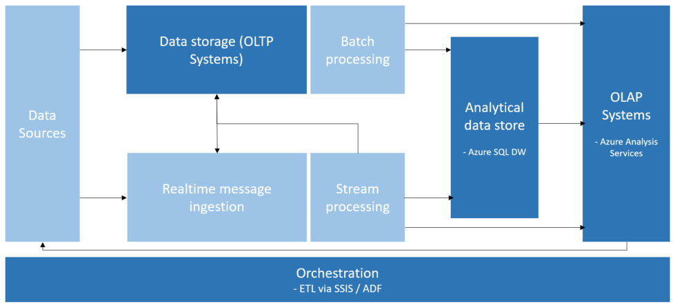

# Online Analytical Processing

[About]()  
[When to use this data architecture](#whentouse)  
[Benefits](#benefits)  
[Challenges](#challenges)  
[OLAP in Azure](#inazure)   
[Where to go from here](#wheretogo)  

The databases that a business uses to store all its transactions and records are called [online transaction processing (OLTP)](online-transaction-processing.md) databases. These databases usually have records that are entered one at a time and that contain a wealth of information that can be used by strategists to make informed decisions about their business. The databases that are used to store the data, however, were not designed for analysis. Therefore, retrieving answers from these databases is costly in terms of time and effort. Online analytical processing (OLAP) systems were designed to help extract this business intelligence information from the data in a highly performant way. This is because OLAP databases are optimized for heavy read, low write operations.

## When to use this architecture

Choose OLAP when you need to rapidly execute complex analytical and ad hoc queries without negatively impacting your OLTP systems trying to conduct other transactions. Also consider using this architecture when you want to provide business users with a simple way to generate reports off your data, without them needing to know how to work with the underlying data relationships, figure out naming conventions, and when you want to provide a number of aggregations that will allow them to have fast, consistent results. OLAP really shines when you want to apply aggregate calculations over large amounts of data.

## Benefits

OLAP systems are optimized for read heavy scenarios, such as analytics and business intelligence.

OLAP allows business users to slice and dice data as needed, regardless of whether the source data is partitioned across several data sources. This helps users to find trends, spot patterns, drill down, and 'wander' around the data without having to know the detailed ins and outs of traditional data analysis.

The semantic models business users can use help abstract relationship complexities and make it easier to analyze the data much faster than they'd be able to otherwise, if at all.

## Challenges

For all the benefits OLAP systems provide, they do produce a few challenges:

- Whereas data in OLTP systems is constantly updated through transactions flowing in from various sources, OLAP data stores are typically refreshed at a much slower cadence, depending on business needs. This means OLAP systems are better suited for strategic business decisions, rather than immediate responses to changes. Additionally, some level of data cleansing and orchestration needs to be planned to keep the OLAP data stores up-to-date.
- Unlike traditional, normalized, relational tables found in OLTP systems, OLAP data models tend to be multi-dimensional. This makes it difficult or impossible to directly map to entity-relationship or object-oriented models, where each attribute is mapped to one column. Instead, OLAP systems typically use a star or snowflake schema in place of traditional normalization.

## OLAP in Azure

In Azure, data held in OLTP systems (Azure SQL Database, and the like) and/or analytical data stores is copied into the OLAP system, such as [Azure Analysis Services](https://docs.microsoft.com/azure/analysis-services/analysis-services-overview). Data exploration and visualization tools like [Power BI](https://powerbi.microsoft.com), Excel, and third-party options connect to Analysis Services servers and provide users with highly interactive and visually rich insights into your model data.

## Where to go from here
Read Next:
[Online Analytical Processing (OLAP) data store technology choices](../technology-choices/olap-data-stores.md)

See Also:

Related Technology Choices
- Transactional data stores
    - [Online Transaction Processing (OLTP) data stores](../technology-choices/oltp-data-stores.md)
    - [Online Analytical Processing (OLAP) data stores](../technology-choices/olap-data-stores.md)
    - [Data Warehouses](../technology-choices/data-warehouses.md)