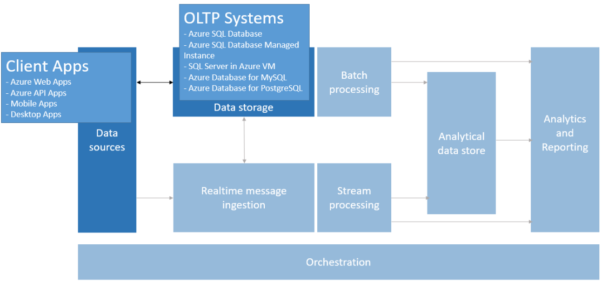

# Online Transaction Processing (OLTP)

[About]()  
[When to use this data architecture](#whentouse)  
[Benefits](#benefits)  
[Challenges](#challenges)  
[OLTP in Azure](#challenges)   
[Where to go from here](#wheretogo)  

The management of [transactional data](../common-architectures/transactional-data.md) using computer systems is referred to as Online Transaction Processing or OLTP. OLTP systems record the business interactions as they occur in the day-to-day operation of the organization.

## When to use this architecture
Choose OLTP when you have a data pipeline from source to data storage that needs to efficiently process and store business interactions and immediately make them available to client applications in a consistent way, where any tangible delay in efficiency would have a negative impact on the day-to-day operations of the business.  

## Benefits
OLTP systems are designed to efficiently process and store transactions. 

The goal of efficiently processing and storing individual transactions by OLTP system is in part accomplished by data normalization- that is breaking the data up into smaller chunks that are less redudant once stored. This supports efficiency because it enables the OLTP system to process large numbers of transactions independently, and without one transaction interfering with another. 

## Challenges
The data normalization approach utilized by OLTP systems produces a few challenges:
- OLTP systems are not typically typically good for handling aggregates over large amounts of data. Analytics against the data that relies on aggregate calculations over millions of individual trasactions are very resource intensive for the OLTP system, can be slow to execute and can cause a slow-down by blocking other transactions attempting to happen in the database and by extension the operations of the business. 
- The increased normalization increases query complexity as most queries need to be constructed to de-normalize the data by using joins before it can be useful to the business. Additionally, naming conventions for database object in OLTP systems tend to be terse and succinct. The increased normalization coupled with terse naming convetions makes OLTP systems difficult for business users attempting to query them for analytics purposes without the help of a DBA or data developer. 
- OLTP systems are not designed to store the history of transactions in perpituity and performance suffers when too much data lands in anyone table. The common solution is to maintain a relavant window of time (such as the current fiscal year) in the OLTP system and offload historical data to other systems, such as a [datamart](./data-mart.md) or [data warehouse](./data-warehouse.md).

## OLTP in Azure
In Azure, applications have bidirectional communication with the OLTP system. Applications such as websites hosted in Azure Web Apps, REST API's running within API Apps, or mobile or desktop applications communicate with the OLTP system (typically via a REST API intermediary).  

## Where to go from here
Read Next:
[Online Transaction Processing (OLTP) data stores](../technology-choices/oltp-data-stores.md)

See Also:

Related Technology Choices
- Transactional data stores
    - [Online Transaction Processing (OLTP) data stores](../technology-choices/oltp-data-stores.md)
    - [Online Analytical Processing (OLAP) data stores](../technology-choices/olap-data-stores.md)
    - [Data Warehouses](../technology-choices/data-warehouses.md)