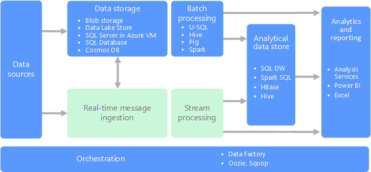
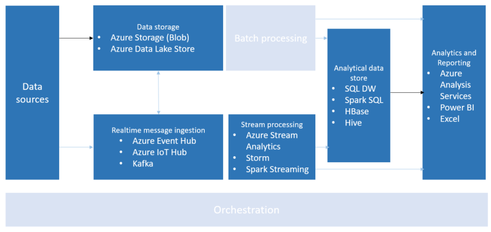

# Processing CSV and JSON files

[About]()  
[When to use this data architecture](#whentouse)  
[Benefits](#benefits)  
[Challenges](#challenges)  
[Processing CSV and JSON files in Azure](#inazure)   
[Where to go from here](#wheretogo)  

CSV (comma-separated values) files are commonly used to exchange tabular data between systems, in plain text. They typically contain a header row that provides column names for the data, but are otherwise considered semi-structured. This is due to the fact that CSVs cannot naturally represent hierarchical or relational data. Data relationships are typically handled with multiple CSV files, where foreign keys are stored in columns of one or more files, but the relationships between those files are not expressed by the format itself. Despite having the moniker "CSV", the term can also be used to denote plain text files that use other delimiters such as tabs or spaces.

Though these limitations exist, CSV files are a popular choice for data exchange due to wide ranging support in business, consumer, and scientific applications. For example, database and spreadsheet programs can import and export CSV files, offering options to specify the delimiter and quotation character used within the file. Similarly, most batch and stream data processing engines, such as Spark and Hadoop, natively support serializing and deserializing CSV-formatted files and offer ways to apply a schema on read. This makes it easier to work with the data, by offering options to query against it and store the information in a more performant data format for faster processing.

Data stored in JSON (JavaScript Object Notation) files is represented as key-value pairs in a semi-structured format. JSON is often compared to XML, as both are capable of storing data in hierarchical format, with child data represented inline with its parent. Both are self-describing and human readable, but JSON documents tend to be much leaner, leading to their popular use in online data exchange, especially with the advent of REST-based web services. Since a lot of data coming across the wire is already in JSON format, most web-based programming languages support working with JSON natively, or through the use of external libraries to serialize and deserialize the data stored within. This universal support for JSON has led to its use in logical formats through data structure representation, exchange formats for hot data, and data storage for cold data.

This last bit about storage for cold data can mean a couple of things. First, batch and stream data processing engines tend to natively support JSON serlialize/deserialization, similar to CSV-formatted files. Though the data contained within JSON documents may ultimately be stored in a more performance-optimized formats, such as  Parquet or Avro, it serves as the raw data for "source of truth", which is critical for re-processing the data as needed. Secondly, JSON is a commonly used file format for NoSQL databases, such as MongoDB, Couchbase, and Cosmos DB.

The most common use of CSV and JSON files is for exchanging or ingesting data into your environment. CSVs are more commonly used for exporting and importing data that can be used to store the data in a variety of databases, or processing it for analytics and machine learning. JSON-formatted files have the same benefits, but are more prevalent in hot data exchange solutions, where JSON documents are sent across the wire by web and mobile devices performing online transactions, by IoT (internet of things) devices for one-way or bidirectional communication, communicating with SaaS and PaaS services or serverless architectures, as well as between nodes within a microservices architecture.

## When to use this architecture
Use CSV and JSON file processing when your data arrives in a semi-structured format. Typically, this means that you need to store the data in another form that complies with your environment's data storage needs, such as within a database, when you need to apply a schema on the semi-structured data to make it easier to query and analyze.

## Benefits
CSV and JSON file formats both have the benefit of making it easy to exchange data between dissimilar systems or devices. Their semi-structured formats allow flexibility in transferring almost any type of data, and universal support for these formats make them simple to work with. Both can be used as the raw "source of truth" in cases where the processed data is stored in binary formats that are more performant for querying and accessible for business intelligence and analysis applications and services. This allows for re-processing at any point and working with the data in a different way.

JSON-formatted files have these additional benefits:

* Maintains hierarchical structures, making it easier to hold related data in a single document and represent complex relationships.
* Most programming languages provide native support for deserializing JSON into objects, or provide lightweight libraries to do so.
* Supports lists of objects, helping avoid messy translations of lists into a relational data model.

## Challenges
There are some challenges to consider when working with these formats:

* Absent of any restraints on the data model, CSV and JSON files are prone to "garbage in, garbage out". For instance, there's no notion of a date/time object in either file, so the file format does not prevent you from inserting "ABC123" in a date field, for example.
* Strictly using CSV and JSON files as your cold storage solution does not scale well when working with big data. In most cases, they are not splittable into partitions for parallel processing, and cannot be compressed as well as binary formats. This often leads to processing and storing this data into read-optimized formats such as Parquet and ORC (Optimized Row Columnar), which also provide indexes and inline statistics about the data contained.

## Processing CSV and JSON files in Azure
Azure provides several solutions for working with CSV and JSON files, depending on your needs.

The primary landing place for these files is either Azure Storage or Azure Data Lake Store. Most Azure services that work with these and other text-based files integrate with either object storage service. In some situations, however, you may opt to directly import the data into Azure SQL or some other data store. When speaking about SQL Server specifically, its native support for storing and working with JSON documents makes it easy to [import and process those types of files](https://docs.microsoft.com/sql/relational-databases/json/import-json-documents-into-sql-server). You can use a utility like SQL Bulk Import to easily [import CSV files](https://docs.microsoft.com/sql/relational-databases/json/import-json-documents-into-sql-server).

Once stored, you can process the documents in batch or real-time. Both pipelines are shown below, along with the related services you may opt to use.

Batch processing is used in a variety of scenarios, from the initial data munging efforts to a more complete ETL (extract-transform-load) pipeline, to preparing data for ultimate consumption over very large data sets or where the computation takes significant time. Batch processing typically either leads to further interactive exploration (downstream analytics), provides the modeling-ready data for machine learning, or lands the data in a data store optimized for analytics and visualization.

One example of batch processing is transforming a large set of flat, semi-structured CSV or JSON files into a schematized (and structured format) that is ready for further querying. Along with this, typically the format is converted from the raw formats used for ingest (such as CSV) to binary formats that are more performant for querying because they store data in a columnar format, and often provide indexes and inline statistics about the data contained.

With batch processing, typically there is a bit of orchestration required to migrate or copy the data into your data storage, batch processing, analtyical data store, and reporting layers.

Real-time processing is defined as the processing of a typically infinite stream of input data, whose time until results ready is short — measured in milliseconds or seconds in the longest of cases. This incoming typically arrives in an unstructured or semi-structured format, like JSON, and has the same processing requirements as with batch, but with shorter turnaround times to support real-time consumption.

Processed data oftentimes land in an analytical data store, which is optimized for analytics and visualization. In other cases, the processed data can be ingested directly into the analytics and reporting layer for analysis, business intelligence, and real-time dashboard visualization.

## Where to go from here
Read Next:
[CSV and JSON file processing technology choices](../technology-choices/csv-json-options.md)

See Also:

Related Solution Patterns
- Handling Unstructured Data
    - [Processing Free-form Text](./processing-free-form-text.md)
